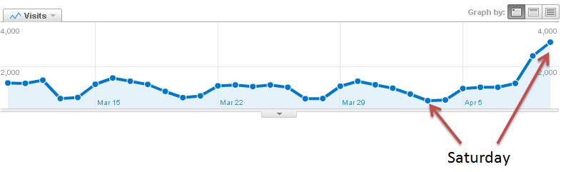
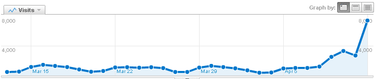

This:  
  

 In case you missed it, Google announced that [site performance now affects your search rankings](http://googlewebmastercentral.blogspot.com/2010/04/using-site-speed-in-web-search-ranking.html) and in the article they included [WebPagetest](http://www.webpagetest.org/) in the list of tools to use.  I appreciate the props but it's been a busy day adding more testing capacity to get ready for Monday :-)  
  
Edit:  As expected, Monday was pretty busy:  
  

