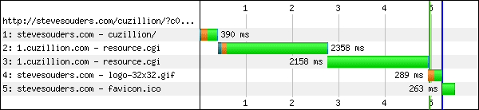
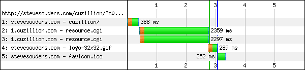

Hopefully by now it's clear that javascript in the head is bad - it blocks parallel requests from loading (for all but the newest browsers).  If you can't move it all to the bottom of your document or make it async then we usually recommend combining it into a single file and putting it after the CSS so that it will load in parallel with the CSS and reduce the pain.  This works because it's actually the **EXECUTION** of the javascript that causes the browser to block any other requests but it will go ahead and fetch the javascript file in parallel to whatever it is currently loading (css) to get it ready to execute.  
  
I've bumped into an issue with this a few times recently on pages I've been looking at so I figured it was worth warning everyone to avoid this:  
  

> <link rel="stylesheet" type="text/css" href="my.css" />
> 
> 

That little bit of inline javascript causes the browser to not load the external js at the same time as the css because it needs to block to execute the code.  
  
  
Thanks to [Steve](http://stevesouders.com/)'s handy [Cuzillion app](http://stevesouders.com/cuzillion/) I threw together a quick page with exactly that structure and this is how it loads:  
  
  

  
  
**Move the inline javascript up above the css**  
  
  
As long as the javascript isn't going to be modifying the css, you'll be a lot better off moving the inline code up above the css so it can execute without having to block anything else.  If you're just setting variables for later javascript to use then this is a no-brainer.  
  
Here is what it looks like with the inline javascript moved up above the css:  
  
  

  
  
The javascript is back where it should be, loading in parallel to the css.