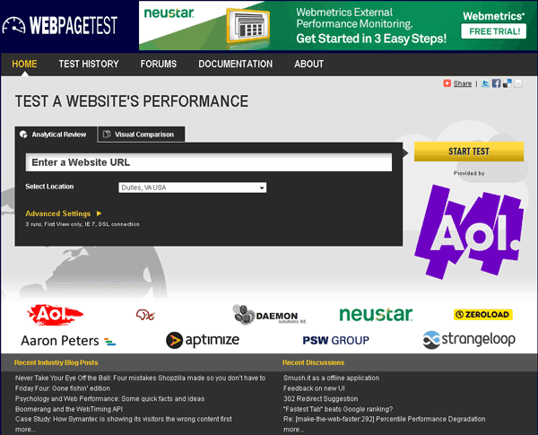
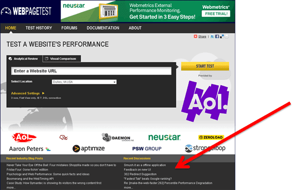
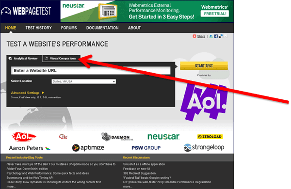
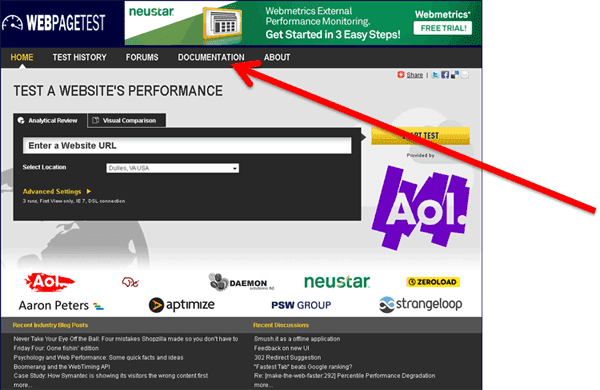
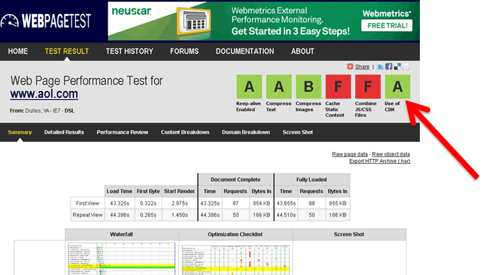
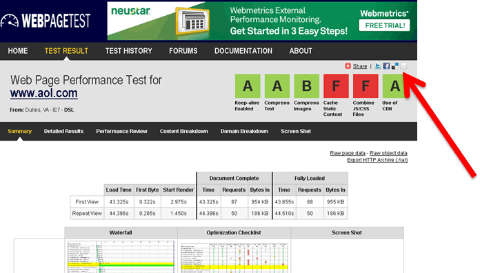
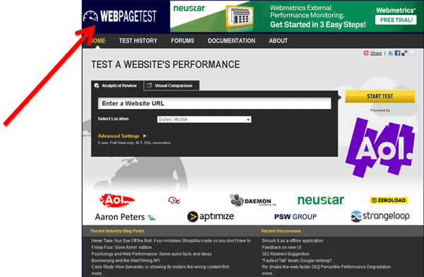

If you've been over to [WebPagetest](http://www.webpagetest.org/) today you may have noticed that things have changed a bit (after you double-checked to make sure you were really at the correct site).  Thanks to [Neustar Webmetrics](http://www.webmetrics.com/) (and [Lenny Rachitsky](http://twitter.com/lennysan) in particular) for kicking in an actual designer to bring the UI out of the dark ages hopefully performance testing will be less intimidating to new users while still keeping all of the functionality that the more advanced users like.  All of the existing functionality is still there (with very similar navigation) but there are a few enhancements I managed to get in with the update as well...

  

  

 **Feeds**

  

  
Right at the bottom of the site (across all of the pages) is a blogroll (left column) of performance-focused blogs and a feed of recent discussions (right column) that pulls from the WebPagetest forums, the Yahoo Exceptional Performance group and the "Make the Web Faster" Google group.  If you have a blog that you would like included (that is focused on web performance) [shoot it to me](mailto:pmeenan@webpagetest.org) and I'll get it added to the feed.  
  

**Simplified Navigation**

  

  
There used to be 3 separate "landing" pages.  One with some high-level information, one for testing individual pages and one for running visual comparisons.  All three have been collapsed into a single page.  
  

**New Performance Documentation Wiki**

  

  
There are a lot of discussions in the forums that end up with really valuable information on how to fix something (keep-alives being broken for IE on Apache comes up frequently).  I decided to set up a new destination to serve as a place to document these findings as well as serve as a central repository for performance knowledge.  [Web Performance Central](http://www.webperformancecentral.com/wiki/Main_Page) is an open wiki for the community to contribute to the knowledge base of performance.  I will be hosting my documentation there and it is open for anyone else to do the same and hopefully we can start getting a reasonable knowledge base built (it's really bare right now - mostly just the site).  
  
I'll commit to running the site without any branding and with no advertising so it can be a completely unbiased source for performance information.  
  

**More Prominent Grades**

  
  

  
The grades for the key optimizations are now across the top of all of the results pages and clicking on any of them will take you to the list of requests/objects that caused the failure.  Eventually when the documentation is in place I hope to also link the labels to information on how to fix the problem.  
  

**Social Sharing**

  

  
I also bit the bullet and added a 3rd party widgit to make it easier to share results.  It saves a couple of steps and makes it a lot easier to tweet things like "Wow, site X is painfully slow", etc.  I was a little torn because the addthis widget messes up the layout of the page a little bit in IE7 and below but let's face it, I don't expect that the target demographic for WebPagetest would be using outdated browsers so it was a tradeoff I was willing to make.  
  

**New Logo**

  
I'm not a graphic designer by any stretch of the imagination and the UI designer provided the basis for the new logo but I wanted something that had a transparent background and that I could modify myself so I went and created a new one.  I HIGHLY recommend [Inkscape](http://www.inkscape.org/) for those that haven't tried it. It is a free (open source) vector drawing program that is used even by a lot of professional designers.  I managed to whip together the logo in a few minutes and create it in various different sizes (as well as a favicon) all from the same source (ahh, the beauty of vector graphics).  
  
  
Finally, as a bonus for making it this far, there is an Easter egg in the new UI that lets you change the color scheme if you don't like the blue background.  Just pass a hex color code in as a query parameter and you can use whatever color you want (with the logo auto-switching from white to black as needed).  Here are some to get you started:  
  
The original color scheme provided by the designer: [http://www.webpagetest.org/?color=f1c52e](http://www.webpagetest.org/?color=f1c52e)  
Green: [http://www.webpagetest.org/?color=005030](http://www.webpagetest.org/?color=005030)  
Black: [http://www.webpagetest.org/?color=000000](http://www.webpagetest.org/?color=000000)  
White:  [http://www.webpagetest.org/?color=ffffff](http://www.webpagetest.org/?color=ffffff)  
Orange:  [http://www.webpagetest.org/?color=f47321](http://www.webpagetest.org/?color=f47321)  
  
The color will stick until you clear your cookies or manually reset it.  To reset it to the default just pass an invalid color: [http://www.webpagetest.org/?color=0](http://www.webpagetest.org/?color=0)  
  
As always, feel free to send me any feedback, suggestions or questions.