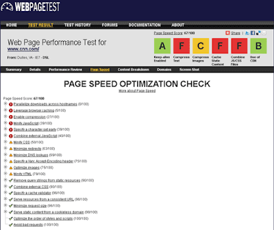

**This is what open source is all about!**   
  
Today we are taking the first step in combining the optimization checks done by [Page Speed](http://code.google.com/speed/page-speed/) and [WebPagetest](http://www.webpagetest.org/) by making the Page Speed results available from within WebPagetest (and from an IE browser for the first time).  Huge thanks go out to the Page Speed team and [Bryan McQuade](http://bryanmcquade.com/blog/) in particular who did the bulk of the work getting it integrated into the Pagetest browser plugin (as well as [Steve Souders](http://www.stevesouders.com/) for encouraging us to collaborate).  
  

**What You Will See**

  
In your test results you will now be getting your Page Speed score along with the normal optimization checks that are done by WebPagetest:  
  

  
Clicking on the link will take you to the [details from Page Speed](http://www.webpagetest.org/result/100905_47F6/3/pagespeed/) about the various checks and what needs to be fixed:  
  

  

**What's next?**

  
As I mentioned, this is just the first step.  The long-term plans are to take the best of both tools, enhance the Page Speed checks and standardize on Page Speed for optimization checking.  You'll probably see the individual rules start to migrate slowly (with things like gzip and caching being no-brainers since the logic is essentially identical between the two tools) so it should be pretty seamless from the end-user perspective.  You will also see the Page Speed checks enhanced to include the DOM-based checks that you're used to seeing in the Firefox plugin.