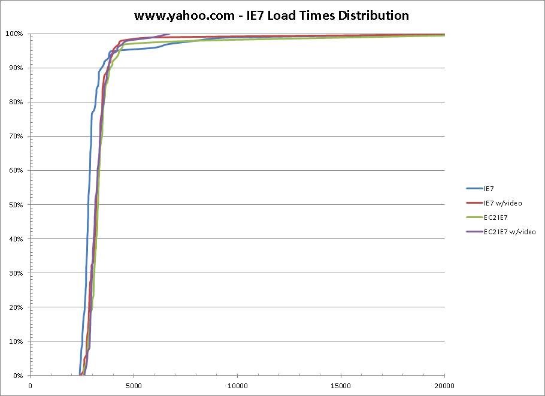
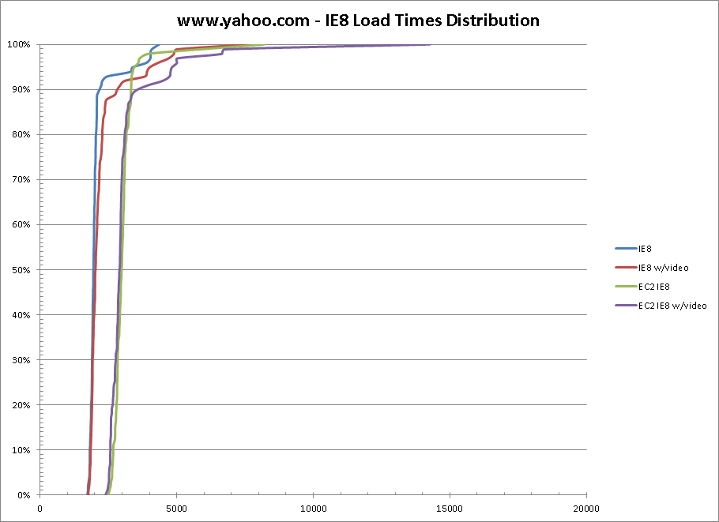
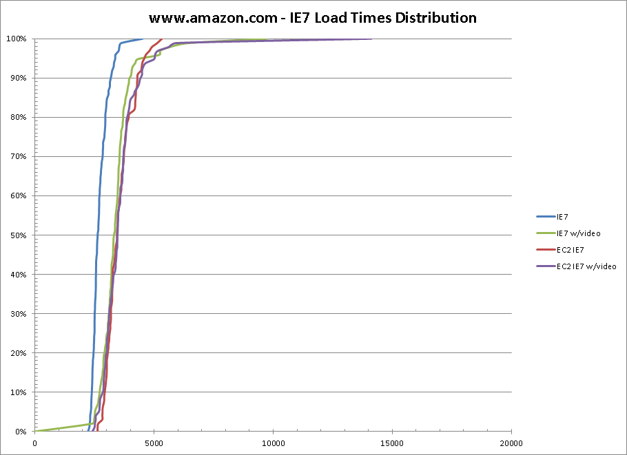
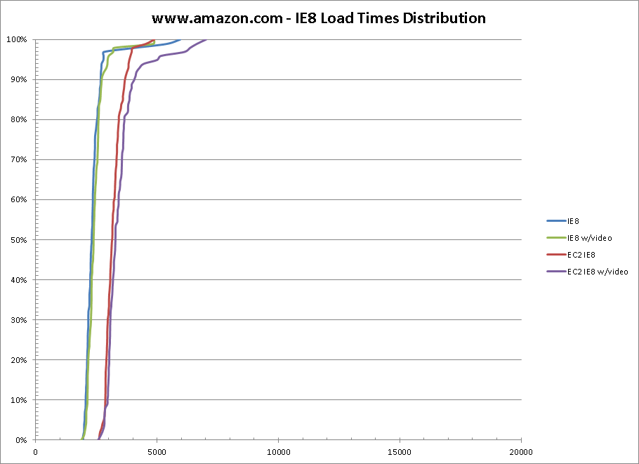
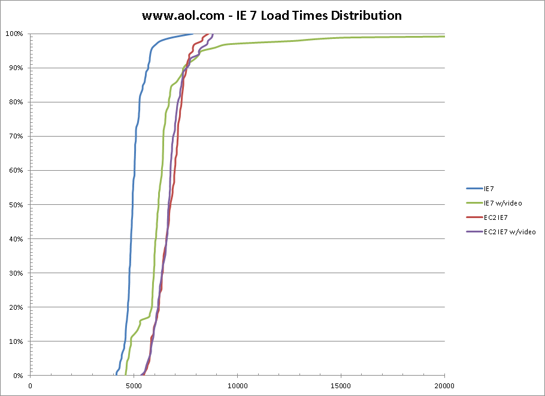
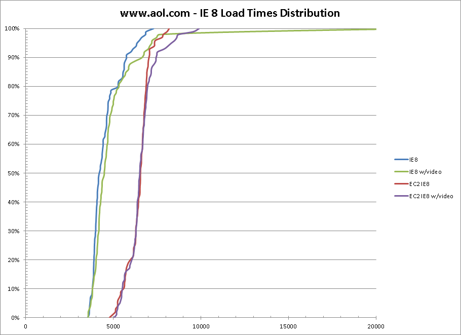

One thing I've always been concerned about is people taking a single measurement point and using that as representative of the performance of their site.  Even for a well-performing platform (where the back-end is consistent) there are a lot of variations and sometimes significant outliers (I usually recommend taking at least 3 measurements and throwing out any that look obviously wrong).  
  
Recently I've been looking at options for moving the Dulles testers for [WebPagetest](http://www.webpagetest.org/) out of my basement and into an actual data center (picture of the "Meenan Data Center" will be posted at some point).  There have also been some projects recently where we needed to run a whole lot of tests and it would take several days on the current infrastructure (even in Dulles where I have multiple machines backing the IE7 and IE8 configurations).  I've been looking at co-lo pricing but to do anything of reasonable scale gets pretty expensive, even with virtualization when you factor in the Microsoft tax.  It turns out that Amazon's us-east EC2 region is right next to me in Northern Virginia so it is looking like a very attractive option.  
  
I have also been asked quite a few times about the impact of capturing video on the actual test results (and I've generally steered people away from comparing video-capture results against non-video results).  I jumped through a lot of hoops in Pagetest to minimize the impact and I measured it as "effectively 0" on my dev systems but never did any large-scale testing against the public test systems to see how they perform.  
  
Joshua Bixby also recently [blogged](http://www.webperformancetoday.com/2010/10/26/cpu-memory-issues-with-web-page-tests/) about some testing that Tony Perkins had been doing with EC2 and how the Micro instances were not suitable for performance testing (but small were looking good).  
  
**So, all this means it's time for some testing:**  
  
First, some basics on the configurations at play:  
  
**IE7** - The Dulles IE7 tests are run on physical machines (3Ghz P4's running XP with 512MB of RAM).  There are 4 physical machines running the tests.  
**IE8** - The Dulles IE8 tests are run in a VM running under VMWare ESXi 4.0 (XP with 512MB of Ram).  There are 8 VM's available for testing.  
**EC2** - The EC2 instances (both IE7 and IE8) are running in the us-east region on "small" instances using instance storage (Windows Server 2003 with 1.7GB of Ram).  I had 2 instances of each available for testing so any consistency would not be because of running on the same machine  
  
I ran 100 tests each of www.aol.com, www.amazon.com and www.yahoo.com both with and without video capture.  These are all sites with sufficient infrastructure to provide consistent serving performance and all leverage CDN's.  
  
I'm pretty visual so my favorite way to consume data for this kind of test is to look at a cumulative percentile graph with the load time across the X axis and the percentile along the Y axis.  The more vertical a line is, the more consistent the results and if lines are basically right on top of each other they are performing identically.  
  
**And the results (pretty picture time):**  
  

  

  

  

  

  

  
**So, what does it mean?**  
  

*   It looks like the current Dulles IE7 machines are seeing an impact to the measurements when capturing video (at least in some cases).  
*   Both virtualized environments do NOT appear to be impacted by capturing video
*   EC2 results are generally slower than the current Dulles results (network peering is my best guess because they are using identical traffic shaping)
*   The EC2 results are quite consistent and look promising