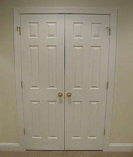
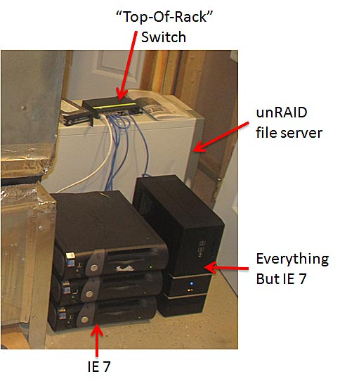
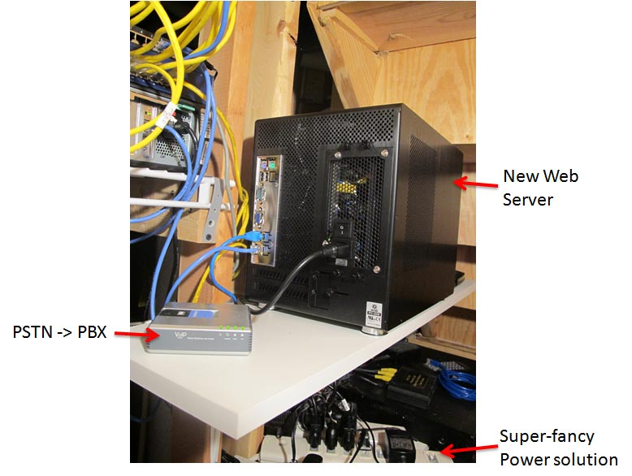
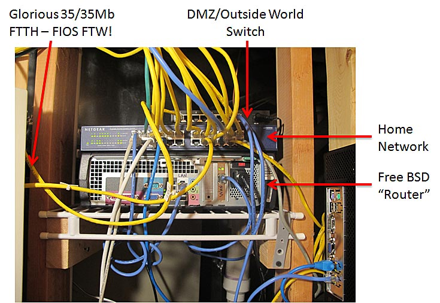

Well, I've been promising to do it for a while and it's finally ready.  If you've ever wondered what the facility looks like that runs the Dulles test location for WebPagetest (and soon the Web Server), here you go...

  

First up, here is the secure entrance to the cage securely below ground level in case of tornados or other such craziness (yes, in case you're wondering - my basement).

  

  

Here are the physical machines grinding away day and night running your tests.  They are co-located with the "climate and humidity control system" (furnace).  The unRAID file server is completely unrelated to WebPagetest, it just happens to be sitting there (and I'm a huge fan of the technology - I can RAID a massive array of disks but only the disk being accessed at a given time spins up so it's great for power consumption).

  

 

Around the corner we have the brand-spanking-new web server that will be running WebPagetest.org (among other random personal sites).  The Voip converter just happens to be there because that's where my phone line comes in and it's great for blocking telemarketers and keeping the phone from ringing when the kids are sleeping.  
  

  
Finally, we have the heart of the data center tour, the network that pulls it all together. I've been completely spoiled by FIOS.  Seriously low latency high bandwidth connectivity right to the home.  The bulk of that wiring is really just my house and random devices (yes, all of the plugged in ports are live - everything has a network connection these days).  The BSD router is overkill these days.  It was there originally because the traffic shaping was done there but now that it has moved into the testers themselves I need to get around to replacing it with something a little less power hungry.  
  

  
And there you have it.  The Meenan Data Center in all it's glory!