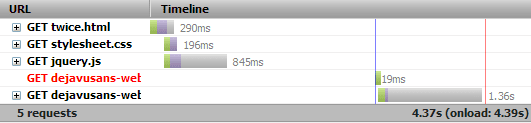
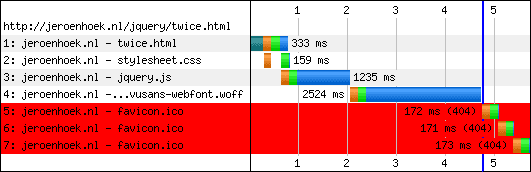
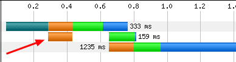

We recently [launched](http://www.webpagetest.org/forums/showthread.php?tid=2797) experimental support for testing with Firefox on [WebPagetest](http://www.webpagetest.org/) and I've already had some interesting questions as people started to see things on WebPagetest that they were not used to seeing when they use the Firebug Net Panel (of which I'm a HUGE fan and user).  
  
When we built the Chrome test agent for WebPagetest we made the decision to try and make it cross-browser and re-use as much code as possible (the re-use is easily over 90% between Chrome and Firefox).  One of the side effects is that we try to get our data from as low as possible in the application stack so we can re-use as much of it as possible and not rely on browser-specific features.  For all practical purposes this means that we get the networking data as the browser sends/retrieves it from the OS.  We don't get visibility into the browser cache but we get really good data on  the actual data that is sent on the wire.  
  
For everything I'm talking about here I'll be using a test page that is part of a [firebug bug](https://code.google.com/p/fbug/issues/detail?id=4649): [http://jeroenhoek.nl/jquery/twice.html](http://jeroenhoek.nl/jquery/twice.html) and talking specifically about just the net panel.  
  
**Favicon**  
  
One of the first pings I got was about favicon.ico errors showing up in WebPagetest but not in Firebug (the requests aren't displayed in Firebug at all):  
  

  

  
It's not necessarily a big deal but it is traffic you should be aware of.  I was particularly surprised to see that Firefox tried to download the favicon 3 times.  Just more reason to make sure you always have a valid one - eliminates 3 hits to your server in the case of Firefox.  
  
**Socket Connect**  
  
Another interesting difference is the socket connect behavior.  When we implemented the Chrome agent we had to deal with the initial connections not necessarily being right before a request because of Chrome's pre-connect logic.  The Firefox agent inherited the capability and it looks like it's a good thing it did because Firefox 6 appears to also pre-connect (looks like it opens 2 connections to the base domain immediately.  
  

  
In Firebug the connection is right up next to the request (I expect this is a limitation in the waterfall and not the measurement itself).  

  
Interestingly, it looks like Firefox pre-connected 2 additional connections in my Firebug test but that's possibly because Firefox had learned that that page needed more than 2 connections (WebPagetest uses a completely clean profile for every test and my Firebug test was on my desktop with a clear cache but not a new profile).  
  
**Duplicate Requests**  
  
Finally, the actual topic of the bug report, Firebug shows an aborted request for the web font.  If the aborted request is real, it was completely internal to Firefox and never hit the wire because the WebPagetest trace shows just the single request.  
  
**Finally**  
  
These are just the things that have jumped out at me over the last couple of days.  Let me know if you see any other interesting differences.  As always, it's great to have tools that measure things differently so we can validate them against each other (and confirm behaviors we are seeing to make sure it's not a measurement problem).