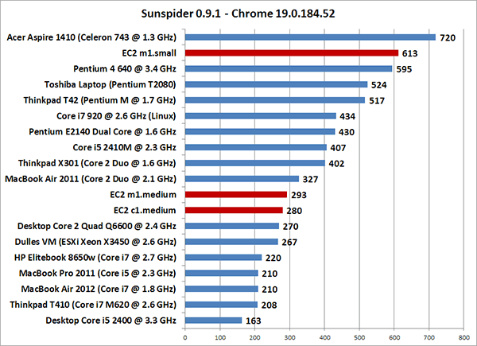

WebPagetest makes [EC2 AMI's](https://sites.google.com/a/webpagetest.org/docs/private-instances#TOC-EC2-Test-Agents) available for people to use for running private instances and makes fairly extensive use of them for running the testing for the [Page Speed Service comparisons](http://www.webpagetest.org/compare).  We have tested that the m1.small instances produce consistent results but we aren't necessarily sure if they are representative of real end-user machines so I decided to do some testing and see.  
  
This is a very specific test that is just looking to compare the raw CPU performance for web browsing (single threaded) of various EC2 instance sizes against physical machines.  It is not meant to be a browser comparison or a statement about EC2 performance beyond this very-specific use case.  
  
**Testing Methodology**  
  
I ran the [SunSpider 0.9.1](http://www.webkit.org/perf/sunspider-0.9.1/sunspider-0.9.1/driver.html) benchmark 5 times on each of the different machines using Chrome 19 (it is important to keep the browser and version consistent since changes to the JavaScript engine will affect the results).  
  
**Results**  
  

  
As you can see, the m1.small instances are significantly slower than desktop systems from the last 5 years or so  but it is somewhat faster than more recent low-end laptops.  Netbooks and tablets are significantly slower still with times typically in the 1000+ range.  
  
**Conclusion**  
  
Unfortunately there isn't a clear-cut answer of what you should use to test if you are trying to test on a "representative" system because both the smaller and larger instances are representative of different ends of the computing spectrum.  
  
My general feeling is that websites should not be CPU constrained and if they are then things will look exponentially worse on the tablets, chrome books and other cheap devices that are starting to flood the market.  If you test using the larger instances then you will be testing on systems more representative of desktops which might be a good thing to do if that is specifically what you are targeting.  The small instances are more likely to expose CPU constraints that will crop up in your user base (much like [Twitter noticed](http://engineering.twitter.com/2012/05/improving-performance-on-twittercom.html)).  
  
**Call for Help**  
  
The systems I tested were machines that I had easy access to but are probably not representative of a lot of systems people have at home.  If you could run [SunSpider](http://www.webkit.org/perf/sunspider-0.9.1/sunspider-0.9.1/driver.html) using Chrome 19 on any systems you have lying around and share the results as well as the system specs in the comments below I'll update the chart and see if we can build a more representative picture.  
  
\*update - chart has been updated with the user-submitted results, thank you