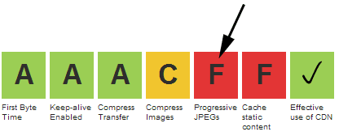
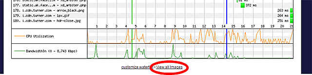
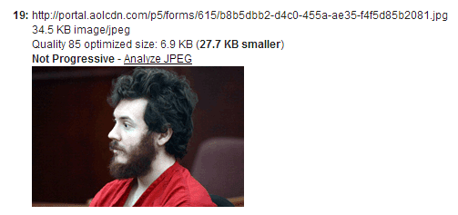

**TL;DR:** Progressive JPEGs are one of the easiest improvements you can make to the user experience and the penetration is a shockingly-low 7%.  [WebPagetest](http://www.webpagetest.org/) now warns you for any JPEGs that are not progressive and provides some tools to get a lot more visibility into the image bytes you are serving.  
  
I was a bit surprised when Ann Robson measured the penetration of progressive JPEGs at 7% in her [2012 Performance Calendar article](http://calendar.perfplanet.com/2012/progressive-jpegs-a-new-best-practice/).  Instead of a 1,000 image sample, I crawled all 7 million JPEG images that were served by the top 300k websites in the May 1st [HTTP Archive](http://httparchive.org/) crawl and came out with....wait for it.... still only 7% (I have a lot of other cool stats from that image crawl to share but that will be in a later post).  
  

## Is The User Experience Measurably Better?

  
Before setting out and recommending that everyone serve progressive JPEGs I wanted to get some hard numbers on how much of an impact it would have on the user experience.  I put together a pretty simple transparent proxy that could serve arbitrary pages, caching resources locally and transcoding images for various different optimizations.  Depending on the request headers it would:  
  

*   Serve the unmodified original image (but from cache so the results can be compared).
*   Serve a baseline-optimized version of the original image (jpegtran -optimize -copy none).
*   Serve a progressive optimized version (jpegtran -progressive -optimize -copy none).
*   Serve a truncated version of the progressive image where only the first 1/2 of the scan lines are returned (more on this later).

I then ran a suite of the Alexa top 2,000 e-commerce pages through WebPagetest comparing all of the different modes on a 5Mbps Cable and 1.5Mbps DSL connection.  I first did a warm-up pass to populate the proxy caches and then each permutation was run 5 times to reduce variability.

  

The full test results are available as Google docs spreadsheets for the [DSL](https://docs.google.com/spreadsheet/ccc?key=0As3TLupYw2RedC1Fd29hQVJYTWs3Z1NXWkVWcWNWUGc&usp=sharing) and [Cable](https://docs.google.com/spreadsheet/ccc?key=0As3TLupYw2RedDYtaXRlcVhzdFV3WDNqYXljSW4tR3c&usp=sharing) tests.  I encourage you to look through the raw results and if you click on the different tabs you can get links for filmstrip comparisons for all of the URLs tested (like [this one](http://www.webpagetest.org/video/compare.php?tests=130512_8Y_ZV6-l:Original,130512_0N_ZV7-l:Optimized,130512_TQ_ZV8-l:Progressive,130512_23_ZV9-l:Truncated,)).

  
Since we are serving the same bytes, just changing HOW they are delivered, the full time to load the page won't change (assuming an optimized baseline image as a comparison point).  Looking at the Speed Index, we saw median **improvements of 7% on Cable and 15% on DSL**.  That's a pretty huge jump for a fairly simple serving optimization (and since the exact same pixels get served there should be no question about quality changes or anything else).  
  
Here is what it actually looks like:  
  

  
  
Some people may be concerned about the extremely fuzzy first-pass in the progressive case.  This test was just done with using the default jpegtran scans.  I have a TODO to experiment with different configurations to deliver more bits in the first scan and skip the extremely fuzzy passes.  By the time you get to 1/2 of the passes, most images are almost indistinguishable from the final image so there is a lot of room for improving the experience.  
  

## What this means in WebPagetest

  
Starting today, WebPagetest will be checking every JPEG that is loaded to see if it is progressive and it will be exposing an overall grade for progressive JPEGs:  
  

The grade weights the images by their size so larger images will have more of an influence.  Clicking on the grade will bring you to a list of the images that were not served progressively as well as their sizes.  
  
Another somewhat hidden feature that will now give you a lot more information about the images is the "View All Images" link right [below the waterfall](http://www.webpagetest.org/result/130604_91_9cf2961f604473e3cab0edaab675c167/1/details/#view-images):  
  

  
It has been beefed up and [now displays optimization information](http://www.webpagetest.org/pageimages.php?test=130604_91_9cf2961f604473e3cab0edaab675c167&run=1&cached=0) for all of the JPEGs, including how much smaller it would be when optimized and compressed at quality level 85, if it was progressive and the number of scans if it was:  

  
The "[Analyze JPEG](http://www.webpagetest.org/jpeginfo/jpeginfo.php?url=http%3A%2F%2Fportal.aolcdn.com%2Fp5%2Fforms%2F615%2Fb8b5dbb2-d4c0-455a-ae35-f4f5d85b2081.jpg)" link takes you to a view where it shows you optimized versions of the image as well as dumps all of the meta-data in the image so you can see what else is included.  
  

## What's next?

  
With more advanced scheduling capabilities coming in HTTP 2.0 (and already here with SPDY), sites can be even smarter about delivering the image bits and re-prioritize progressive images after enough data has been sent to render a "good" image and deliver the rest of the image after other images on the page have had a chance to display as well.  That's a pretty advanced optimization but it will only be possible if the images are progressive to start with (and the 7% number does not look good).  
  
Most image optimization pipelines right now are not generating progressive JPEGs (and aren't stripping out the meta-data because of copyright concerns) so there is still quite a bit we can do there (and that's an area I'll be focusing on).  
  
Progressive JPEGs can be built with almost arbitrary control over the separate scans.  The first scan in the default libjpeg/jpegtran setting is extremely blocky and I think we can find a much better balance.  
  
At the end of the day, I'd love to see CDNs automatically apply lossless image optimizations and progressive encoding for their customers while maintaining copyright information.  A lot of optimization services already do this and more but since the resulting images are identical to what came from the origin site I'm hoping we can do better and make it more automatic (with an opt-out for the few cases where someone NEEDS to serve the exact bits).