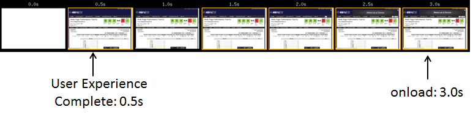
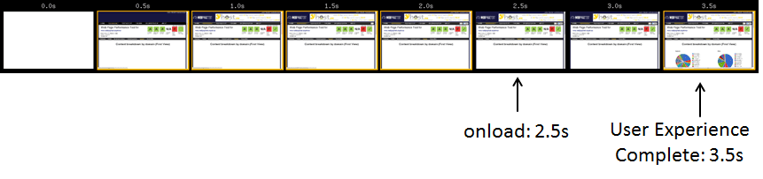
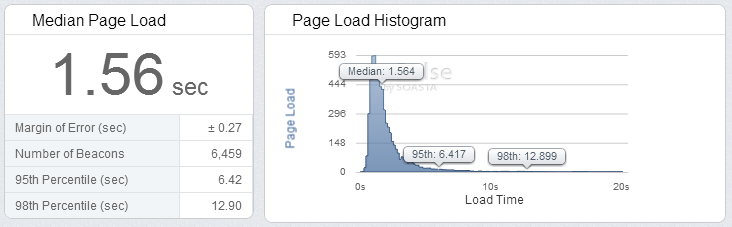
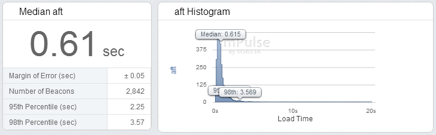
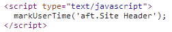
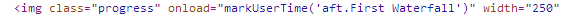
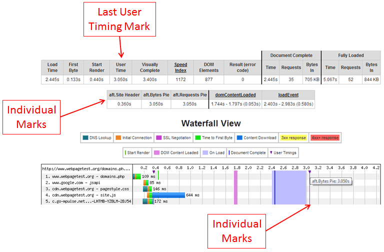
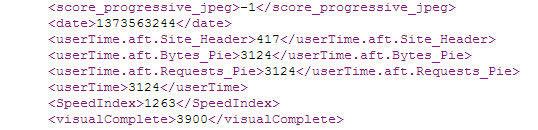

TL;DR: WebPagetest will now expose any [User Timing marks](http://www.w3.org/TR/user-timing/) that a page records so you can use the same custom events for your synthetic test measurement as well as your Real User Measurement (and you can use WebPagetest to validate your RUM measurement points).  
  
Before kicking off an optimization effort it is important to have good measurements in place.  If you haven't already read Steve Souders' blog post on [Moving beyond window.onload()](http://www.stevesouders.com/blog/2013/05/13/moving-beyond-window-onload/), stop now, go read it and come back.  
  
The Page Load time (start of navigation to the onload event) is the cornerstone metric for most web performance measurement and it is a fundamentally broken measurement that can end up doing even more harm than good by getting developers to focus on the wrong thing.  Take two examples of static pages from WebPagetest for example:  
  
The first is the main test results page that you see after running a test.  Fundamentally it consists of the data table and several thumbnail images (waterfalls and screen shots).  There are a bunch of other things that make up the page but they aren't the critical parts of the page for the user.  Specifically, Ads, social buttons (twitter and g+), the partner logos at the bottom of the page, etc.  
  
Here is what it looks like when it loads:  
  

The parts of the page that the user (and I) care about have completely finished loading in 500ms but the reported page load time is 3 seconds.  If I was going to optimize for the page load time I would probably remove the ads, the social widgets, the partner logos and the analytics.  The reported onload time would be better but the actual performance for the user experience would not change at all so it would be completely throw-away work (not to mention detrimental to the site itself).  
  
The second is the domains breakdown page which uses the Google visualization libraries to draw pie charts of the bytes and requests by serving domain:  
  

In this case the pie charts actually load after the onload event and measuring the page load time is really just measuring a blank white page.

  

If you were to compare the load times of both pages using the traditional metrics they would appear to perform about the same but the page with the pie charts has a significantly worse user experience.

  

This isn't really new information, the work I have been doing on the [Speed Index](https://sites.google.com/a/webpagetest.org/docs/using-webpagetest/metrics/speed-index) has largely been about providing a neutral way to measure the actual experience and to do it consistently across sites.  However, if you own the site you are measuring, you can do a LOT better since you know the parts of the page 

  

## Instrumenting your pages

There are a bunch of Real User Measurement libraries and services available (Google Analytics, SOASTA mPulse, Torbit Insight, Boomerang, Episodes) and most monitoring services also have real-user beacons available as part of their offerings.  Out of the box they will usually record the onload time but they usually also have options for custom measurements.  Unfortunately they all have their own APIs right now but there is a W3C standard that the performance group nailed down last year for [User Timing](http://www.w3.org/TR/user-timing/).  It is a very simple API that lets you record point-in-time measurements or events and provides a way to query and clear the list of events.  Hopefully everyone will move to leveraging the user timing interfaces and provide a standard way for marking "interesting" events but it's easy enough to build a bridge that takes the user timing events and reports them to whatever you are using for your Real User Measurement (RUM). 

  

As part of working on this for WebPagetest itself I threw together a [shim](https://gist.github.com/pmeenan/5902672#file-user-timing-rum-js) that takes the user timing events and reports them as custom events to Google Analytics and SOASTA's mPulse or Boomerang.  If you throw it at the end of your page or load it asynchronously, it will report aggregated user timing events automatically.  The "aggregated" part is key because when you are instrumenting a page you can identify when individual elements load but what you really care about is when they have ALL loaded (or all of a particular class of events have happened).  The snippet will report the time of the last event that fired and it will also take any period-separated names (group.event) and report the last time for each group.  In the case of WebPagetest's result page I have "aft.Header Finished", "aft.First Waterfall" and "aft.Screen Shot" (aft being short for above-the-fold".  The library will record an aggregate "aft" time that is the point when everything that I consider critical as above-the-fold has loaded.

  

The results paint a VERY different view of performance than you get from just looking at the onload time and match the filmstrip much better.  Here is what the performance of all visitors from the US to the test results page looks like in mPulse.

  

Page Load (onload):

  

aft (above-the-fold):

  

That's a pretty radical difference, particularly in the long-tail.  A 13 second 98th percentile is something that I might have freaked out about but 4 seconds is quite a bit more reasonable and actually better represents the user experience.

  

One of the cool things about the user timing spec is that the interface is REALLY easy to polyfill so you can use it across all browsers.  I threw together a quick [polyfill](https://gist.github.com/pmeenan/5902672#file-user-timing-js) (feel free to improve on it - it's really basic) as well as a wrapper that makes it easier to do the actual instrumentation.  

  

Instrumenting your page with the helper is basically just a matter of throwing calls to markUserTime() at points of interest on the page.  You can do it with inline script for text blocks:

  

  

  

  

  

or more interestingly, as onload handlers for images to record when they loaded:

  

  

If you can get away with just using image onload handlers that would be the safest bet because inline scripts can have unintended blocking events where the browser has to wait for previous css files to load and process before executing.  It's probably not an issue for an inline script block well into the body of a bage but something to be aware of.  

## Bringing some RUM to synthetic testing

Now that you have gone and instrumented your page so that you have good, actionable metrics from your users, it would be great if you could get the same data from your synthetic testing.  The latest [WebPagetest release](https://github.com/WPO-Foundation/webpagetest/releases) will extract the user timing marks from pages being tested and expose them as additional metrics:

  

At a top-level, there is a new "User Time" metric that reports the latest of all of the user timing marks on the page (this example is from the breakdown pie chart page above where the pie chart shows up just after 3 seconds and after the load event).  All of the individual marks are also exposed and they are drawn on the waterfall as vertical purple lines.  If you hover over the marker at the top of the lines you can also see details about the mark.

  

The times are also exposed in the XML and JSON interfaces so you can extract them as part of automated testing (the XML version has the event names normalized):

  

This works as both a great way to expose custom metrics for your synthetic testing as well as for debugging your RUM measurements to make sure your instrumentation is working as expected (comparing the marks with the filmstrip for example).