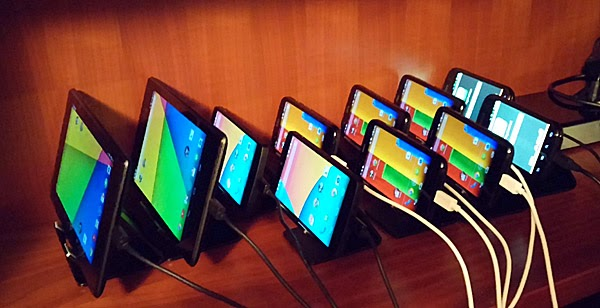
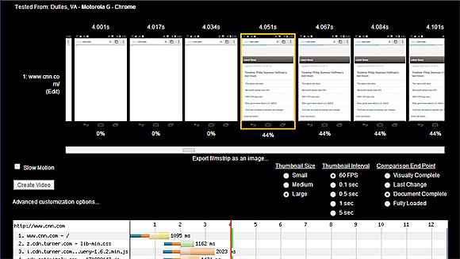
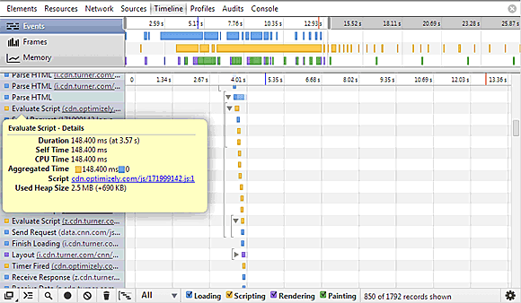

We've been working to bring better support for measuring web performance on mobile for a while.  [Michael Klepikov](https://github.com/klepikov) started out by building out a new cross-platform test agent for WebPagetest that runs on Node.js, can run WebDriver/Selenium scripts and can talk to the Dev Tools interface for Chrome.  [Todd Wright](https://github.com/wrightt)  extended that support to talk to mobile Chrome on android and even Safari on iOS using a [Dev Tools proxy that he created](https://github.com/google/ios-webkit-debug-proxy).  Browser support has been really good for a while and we could get great request data and full timelines but video has always been the blocker for being able to launch.  When Android 4.4 launched with the ability to record 60FPS video on-device with very low overhead it solved the last issue that was holding us back from launching.  
  

**[WebPageTest](http://www.webpagetest.org/) now supports Chrome stable and Beta on Android 4.4**

  
For [private instances](https://sites.google.com/a/webpagetest.org/docs/private-instances) the code is all in [github](https://github.com/WPO-Foundation/webpagetest) and once it has had a couple of weeks of public use and shaking through any issues I'll cut an official release.  If you want to try it out before then you'll need both the web and agent code to support the new video capture capabilities (agent setup instructions are [here](https://sites.google.com/a/webpagetest.org/docs/private-instances/node-js-agent/setup)).  
  
Live on the public instance are a collection of devices in the Dulles location for testing:  
  

  
  
There are:  
  

*   5 Motorola G's
*   2 Nexus 5's
*   1 Nexus 7 in Portrait Mode
*   1 Nexus 7 in Landscape Mode

To select the devices, just select the Dulles location from the location list and they will show up in the list of browsers.

  

All of the devices are also available through the API for automated testing with the location ID's available [here](http://www.webpagetest.org/getLocations.php?f=html).

  

For now all of the devices are using a fixed 3G connection profile but hopefully soon they will have support for arbitrary connection profiles as well.

  

The video capture on the mobile devices is significantly better than what we have on Desktop and I highly encourage you to try it out.  Most of the sites I have tried out take a surprisingly long time to display anything ([one second](http://googlewebmastercentral.blogspot.com/2013/08/making-smartphone-sites-load-fast.html) is a good, aggressive target to shoot for).  Since the mobile devices support much faster capture than desktop, the filmstrip view in WebPageTest has a [new 60FPS option](http://www.webpagetest.org/video/compare.php?tests=140204_M0_X4K-r%3A3-c%3A0&thumbSize=200&ival=16.67&end=doc) for displaying every frame and being able to see EXACTLY when something was displayed.

  

  

The increased resolution really helps when aligning the video with what is happening in the waterfall.

  

We also get full [dev tools timeline](http://www.webpagetest.org/timeline/28/timeline.php?test=140204_M0_X4K&run=3) views of what is going on which is particularly important on mobile given the slower processing (timelines are captured automatically when video is enabled or optionally in the "Chrome" tab of the advanced settings otherwise).

  

  

If you're really adventurous you can also submit [WebDriver/Selenium scripts](https://sites.google.com/a/webpagetest.org/docs/private-instances/node-js-agent/setup#TOC-WebDriver-Scripts) for testing (though it hasn't had a lot of exercise so there may be issues).

  

Most of the test features that you are used to using on desktop still don't work but over the next few weeks we should be able to fill some of them in as well as add some more mobile-specific capabilities:

*   Packet Captures (tcpdump)
*   Arbitrary connection profiles
*   **Testing with Chrome's Data Reduction Proxy enabled**
*   Arbitrary Chrome command-line switches (will allow for DNS rewriting and cert ignoring)
*   Test sharding so individual tests can run in parallel across devices and complete faster
*   Storing of response bodies
*   Javascript disabling
*   SPOF testing
*   Basic WPT scripting support (logData, navigate and exec commands initially)

Take the devices for a spin and [let us know](https://github.com/WPO-Foundation/webpagetest/issues?direction=asc&sort=created&state=open) if you see any issues.  If you don't see the devices online it's possible that the agent threw an exception that we didn't handle and I should be able to bring them back online pretty quickly ([ping me](https://twitter.com/patmeenan) if it looks like they've been offline for a while).