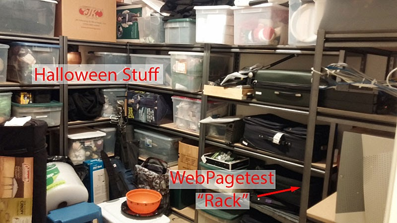
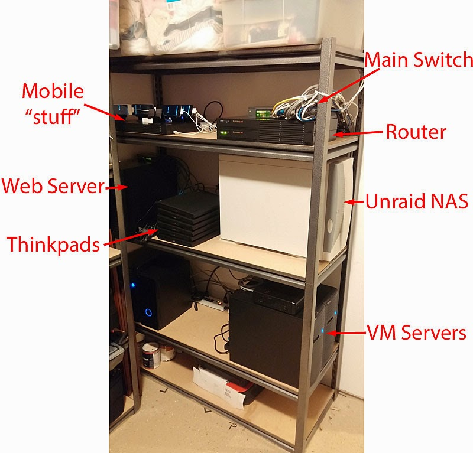
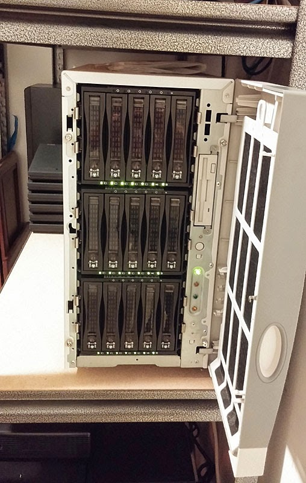
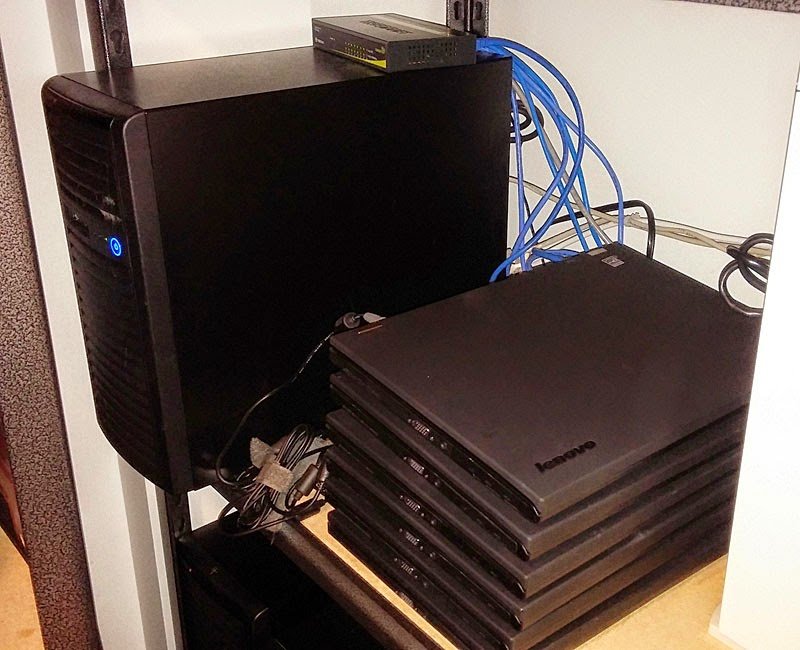
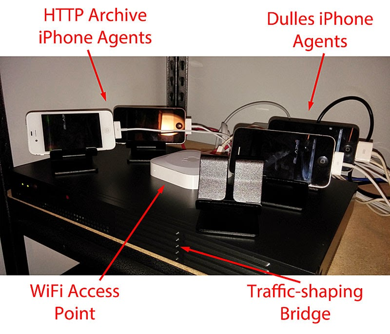
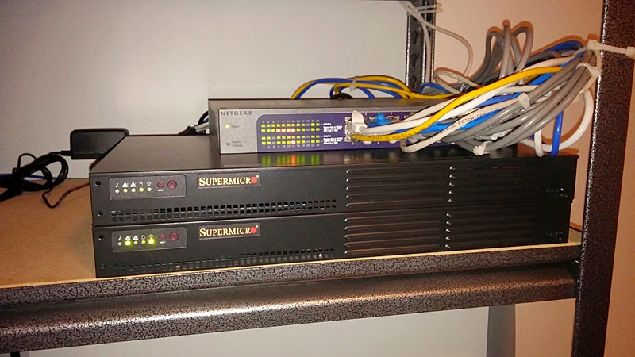
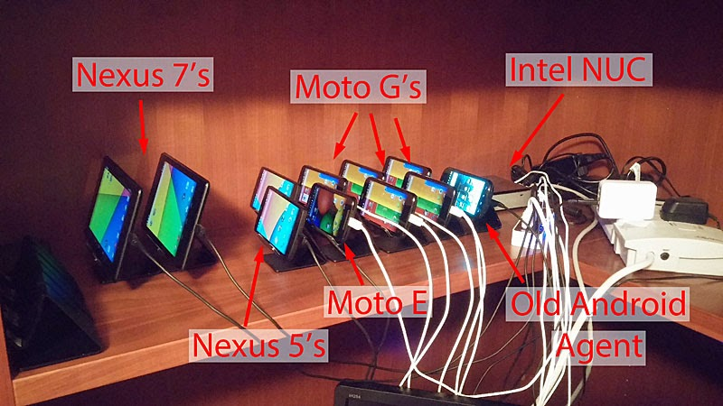

It has been 3 years since the [last tour](http://blog.patrickmeenan.com/2011/01/tour-of-meenan-data-center.html) and a lot of people have been asking if it is still hosted in my basement so it's time for an update.  
  
First, yes it is still hosted out of my basement.  I did move it out of the utility room and into a storage room so if the water heater leaks it will no longer take out everything.  
  

  
Yes, Halloween has gotten a bit out of control. [This](https://www.youtube.com/watch?v=Au0kJ_7R9ts&list=UUCxyrtvl3MpqPA10AyrcB0g) is what it looked like last year (in our garage though the video doesn't quite do it justice).  
  
The WebPagetest "rack" is a gorilla shelf that holds everything except for the Android phones.  
  

  
Starting at the bottom we have the 4 VM Servers that power most of the Dulles desktop testing.  Each server is running VMWare ESXi (now known as VMWare Hypervisor) with ~8 Windows 7 VM's on each.  I put the PC's together myself:  
  
\- Single socket Supermicro Motherboards with built-in IPMI (remote management)  
\- Xeon E3 processor (basically a Core i7)  
\- 32 GB Ram  
\- Single SSD Drive for VM Storage  
\- USB Thumb drive (on motherboard) for ESXi hypervisor  
  
The SSDs for the VM storage lets me run all of the VM's off of a single drive with no I/O contention because of the insane IOPS you can get from them (I tend to use Samsung 840 Pro's but really looking forward to the 850's).  
  
As far as scaling the servers goes, I load up more VM's than I expect to use, submit a whole lot of tests with all of the options enabled and watch the hypervisor's utilization.  I shut down VM's until the CPU utilization stays below 80% (one per CPU thread seems to be the sweet spot).  
  
Moving up the rack we have the [unraid](http://lime-technology.com/) NAS where the tests are archived for long-term storage (as of this post the array can hold 49TB of data with 18TB used for test results).  I have a bunch of other things on the array so not all of that 30TB is free but I expect to be able to continue storing results indefinitely for the foreseeable future.  
  

  
I haven't lost any data (though drives have come and gone) but the main reason I like unraid is if I lose multiple drives it is not completely catastrophic and the data on the remaining drives can still be recovered.  It's also great for power because you can have it automatically spin down the drives that aren't being actively accessed.  
  
Next to the unraid array is the stack of Thinkpad T430's that power the "Dulles Thinkpad" test location.  They are great if you want to test on relatively high-end physical hardware with GPU rendering.  I really like them for test machines because they also have built-in remote management (AMT/vPro in Intel speak) so I can reboot or remotely fix them if anything goes wrong.  I have all of the batteries pulled out so they don't kill them with recharge cycles but if you want built-in battery backup/UPS they work great for that too.  
  
Buried in the corner next to the stack of Thinkpads is the web server that runs [www.webpagetest.org](http://www.webpagetest.org/).  

  

  
The hardware mostly matches the VM servers (same motherboard, CPU and memory) but the drive configuration is different.  There are 2 SSD's in a RAID 1 array that run the main OS, Web Server and UI and 2 magnetic disks in a RAID 1 array that is used for short-term test archiving (1-7 days) before they are moved off to the NAS.  The switch sitting on top of the web server connects the Thinkpads to the main switch (ran out of ports on the main switch).  
  
The top shelf holds the main networking gear and some of the mobile testing infrastructure.  
  

The iPhones are kept in the basement with the rest of the gear and connect WiFi to an Apple Airport Express.  The Apple access points tend to be the most reliable and I haven't had to touch them in years.  The access point is connected to a network bridge so that all of the Phone traffic goes through the bridge for traffic shaping.  The bridge is running Free BSD 9.2 which works really well for dummynet and has a fixed profile set up (for now) so that everything going through it sees a 3G connection (though traffic to the web server is configured to bypass the shaping so the test results are fast to upload).  The bridge is running a supermicro 1U atom server which is super-low power, has remote management and is more than fast enough for routing packets.  
  
There are 2 iPhones running tests for the [mobile HTTP Archive](http://mobile.httparchive.org/) and 2 running tests for the Dulles iPhone testing for WebPagetest.  The empty bracket is for the third phone that is usually running tests for Dulles as well but I'm using it for dev work to update the agents to move from [mobitest](https://code.google.com/p/mobitest-agent/) to the new [nodejs agent](https://sites.google.com/a/webpagetest.org/docs/private-instances/node-js-agent) code.  
  
The networking infrastructure is right next to the mobile agents.  
  

  
The main switch has 2 VLANs on it.  One connects directly to the public Internet (the right 4 ports) and the other (all of the other ports) to an internal network.  Below the switch is the router that bridges the two networks and NATs all of the test agent traffic (and runs as a DHCP and DNS server).  The WebPagetest web server and the router are both connected to the public Internet directly which ended up being handy when the router had software issues and I was in Alaska (I could tunnel through the web server to the management interface on the router to bring it back up).  The router is actually the bottom unit and a spare server is on top of it, both are the same 1U atom servers as the traffic-shaping bridge though the router runs Linux.  
  
My Internet connection is awesome (at least by US pre-Google Fiber standards).  I am lucky enough to live in an area that has Verizon FIOS (Fiber).  I upgraded to a business account (not much more than a residential one) to get the static IP's and I get much better support, 75Mbps down/35Mbps up and super-low latency.  The FIOS connection itself hasn't been down at all in at least the last 3 years.  
  
The Android devices are on the main level of the house right now on a shelf in the study, mostly so I don't have to go downstairs in case the devices need a bit of manual intervention (and while we shake out any reliability issues in the new agent code).  
  

  
The phones are connected through an [Anker usb hub](http://www.amazon.com/gp/product/B005NGQWL2/ref=wms_ohs_product?ie=UTF8&psc=1) to and Intel NUC running Windows 7 where the nodejs agent code runs to manage the testing.  The current-generation NUC's don't support remote management so I'm really looking forward to the next release (January or so) that are supposed to add it back.  For now I'm just using VNC on the system which gives me enough control to reboot the system or any of the phones if necessary.  
  
The phones are all connected over WiFi to the Access point in the basement (which is directly below them).  The actual testing is done over the traffic-shaped WiFi connection but all of the phone management and test processing is done on the tethered NUC system.  I tried Linux on it but at the time the USB 3 drivers were just too buggy so it is running Windows (for now).  The old android agent is not connected to the NUC and is running mobitest but the other 10 phones are all connected to the same host.  I tried connecting an 11th but Windows complained that too many USB device ID's were being used so it looks like the limit (at least for my config) is 10 phones per host.  I have another NUC ready to go for when I add more phones.  
  
One of the Nexus 7's is locked in portrait mode and the other is allowed to rotate (which in the stand means landscape).  All of the rest of the phones are locked in portrait.  I use [these stands](http://www.amazon.com/gp/product/B0087Y1XS4/ref=wms_ohs_product?ie=UTF8&psc=1) to hold the phones and have been really happy with them (and have a few spares off to the left of the picture).  
  
At this point the android agents are very stable.  They can run for weeks at a time without supervision and when I do need to do something it's usually a matter of remotely rebooting one of the phones (and then it comes right back up).  After we add a little more logic to the nodejs agent to do the rebooting itself they should become completely hands-free.  
  
Unlike the desktop testing, the phone screens are on and visible while tests are running so every now and then I worry that the kids may walk in while someone is testing a NSFW site but they don't really go in there (something to be aware of when you set up mobile testing though).  
  
  
One question I get asked a lot is why I don't host it all in a data center somewhere (or run a bunch of it in the cloud).  Maybe I'm old-school but I like having the hardware close by in case I need to do something that requires physical access and the costs are WAY cheaper that if I was to host it somewhere else.  The increased power bill is very slight (10's of dollars a month), I'd have an Internet connection anyway so the incremental cost for the business line is also 10's of dollars per month and the server and storage costs were one-time costs that were less than even a couple of months of hosting.  Yes, I need to replace drives from time to time but at $150 per 4TB drive, that's still a LOT cheaper than storing 20TB of data in the cloud (not to mention the benefit of having it all on the same network).