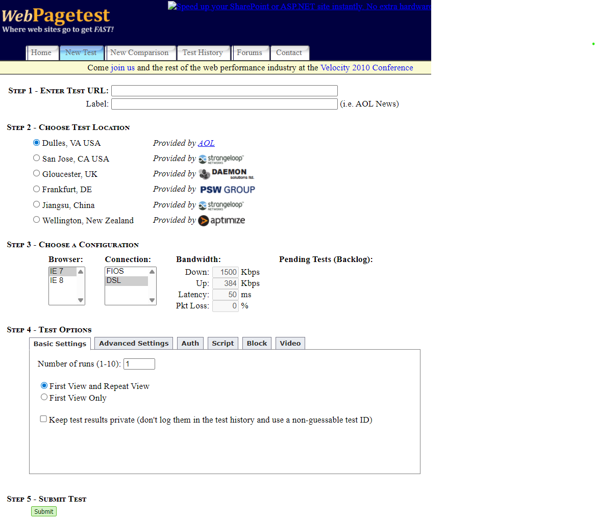

Wow, it has been a minute! Or, more specifically, 12 YEARS!

I've been wanting to move off of blogger for the longest time and had all these ideas for what I wanted to move to to make it easier to post content. Mostly I just wanted to be able to throw together a post in markdown and have some tooling turn that into a "good" static site (responsive, fast, not ugly, etc.). I toyed around with building something with [11ty](https://www.11ty.dev/) a few years ago but never had the time to invest to really learn the platform.

If you have ever had the misfortune of watching one of my [presentations](https://www.youtube.com/@PatrickMeenan/videos) or a website that I actually "designed" you know that I have zero business actually calling it design or being allowed anywhere near a UI.



What I AM good at though is knowing what should be considered for a good technical deployment and user experience and with how the AI overlords are coming for all of our jobs I figured I'd take a stab at seeing how well it could do what I wanted for me. I have a Google One AI Pro family account because it was basically "free" since I was already paying for ~5TB of Google One cloud storage.

## Getting started

I decided to use a two-phase approach (since I'm particularly lazy). I gave Gemini 3.1 Pro Thinking a prompt to generate a prompt for Antigravity to do all of the actual work:

```
Create a prompt for Google Antigravity to migrate blog.patrickmeenan.com to a new blog website that it creates.

Technical requirements for the new site:
- It should be a SSG website using Astro
- It should be responsive and automatically adjust to different devices and viewports
- It should support both dark mode and light mode and automatically set it based on the browser
- All text should be easily legible in both dark mode and light mode
- It should generate each blog post from a markdown file (and linked images)
- Each blog post should be stored in a separate folder with one markdown file and any media content required for the blog post
- The blog post articles should be organized by year, month and day and support multiple posts on a given day
- It should support syntax-coloring for all code blocks for most languages, including but not limited to Bash, Javascript, HTML, c, c++, java and json
- It should support mermaid diagrams in the markdown
- Images should be optimized to load a version of the image no larger than 1280x1280 while maintaining aspect ratio and rotation (including EXIF rotation) and jpeg quality level 85
- Images should be able to be clicked on to view a large version of the image and right-click to save-image-as should work
- It should be well optimized for SEO
- It should be well optimized for performance
- Where they exist, it should use existing best practices

Content requirements:
- The blog post should have the feel of a well-designed modern technical blog
- Up to 3 of the most recent posts should be on the home page with the most recent post being displayed first
- Clicking on the title of a given post should bring you to a dedicated page for that specific post
- There should be a way to navigate to previous/next posts both from an individual post as well as from the home page (and the navigation should include the title of the post being navigated to if it is navigating to a single post)
- There should be an index of all of the blog posts with a way to navigate them by year and by month

Existing content:
- All of the posts from the existing blog at https://blog.patrickmeenan.com/ should be migrated to the new platform
- Each of the existing posts should be recreated as a new markdown file in the appropriate location suited for the new platform with any images used by the posts included in the same folder
- The general structure of the existing posts (title, headings, paragraphs, inline images, links) should be maintained but they should use the default styling of the new platform and the markdown should be as clean as possible.
- The existing article URLs should still work on the new platform. Either by redirect or by using the same URL structure on the new platform. If redirects are used they should be HTTP 301 redirects and in a format suitable for nginx being used as a web server.

When it is complete, Antigravity should check the results to make sure the requirements were met.
```

I ended up being even more specific than I expected to going into it, but I didn't really do all that much planning. I just started typing the requirements and thinking about what I may have missed and then let it go from there. It produced a much more structured version of the prompt with multiple phases but I liked what it produced so I went ahead and copy/pasted that into Antigravity and let it go to town (also with Gemini 3.1 pro thinking).

# Cleaning it up

I was honestly suprised by how well it did. It moved all of the existing blog content over as clean markdown files and largely created what you are looking at now. Nothing was actually "broken" but I did have to come in after it and ask it to make a bunch of corrections. I didn't touch the actual code though, I just pointed out the specific changes I wanted to make or the issues that I was seeing and had it correct itself.

Some of the highlights:
- It had just put links to the blog posts on the home page where I actually wanted the posts themselves to be readable there. My fault for not being specific.
- I forgot to ask it to create an "About" page so I had it add one.
- When it created the about page, the logos for the various services were all giant 580 x 580 svg images and, even after pointing it out, it thought it had sized them correctly. I had to suggest "maybe they should be in containers to constrain the size" at which point it realized what it had to do.
- The image pipeline ONLY worked with jpeg's and broke when I used a png screenshot for this post so I had it add png support.
- The dialog that displayed when you clicked on images was not formatted well. It threw the image into a corner of the screen, had scroll bars and just generally looked bad. It took a few prompts to fix all of the issues with it but the result turned out pretty well.
- The dark and light themes for code blocks were not working right. It was blinding to look at a white-background code block in dark mode and when it fixed that, the actual text was also not correctly switching. It took a few tries but it finally got the color themes for the code blocks working correctly.
- I had it add support for captions below the inline images and then fix the spacing so there wasn't a mile of whitespace between them.
- I had it add a copy button to the code blocks when you hover over them.
- I even used it to change some of the text on the landing page because I was too lazy to hunt it down in the source files.

# The results

At the end of the day, it took maybe 3 hours to complete, which is orders of magnitude faster than it would have been had I done it by hand (and looks and works WAY better than I would have ever been able to produce). That includes writing this post which I used as a test of the publishing pipeline to make sure the whole thing worked as expected.

I'm excited by what the tooling can do these days and I think they're at a point where they can work really well with an experienced engineer to help direct them. It feels a lot like working with an entry-level engineer, just a lot faster. Which is what worries me most about the future of the industry. I'm not sure if they will ever get to the point where they are making the architectural decisions about what to build and how the pieces should go together (or they could and we'll all become product managers) but I worry about how we continue to build that skillset if we start relying on the AI tooling for the kinds of things we'd normally work with and mentor junior engineers on.

Anyway, thanks for suffering through that with me. Hopefully now that the migration is done and putting up a new post is just a simple markdown file I will start posting more regularly than every 12 years.