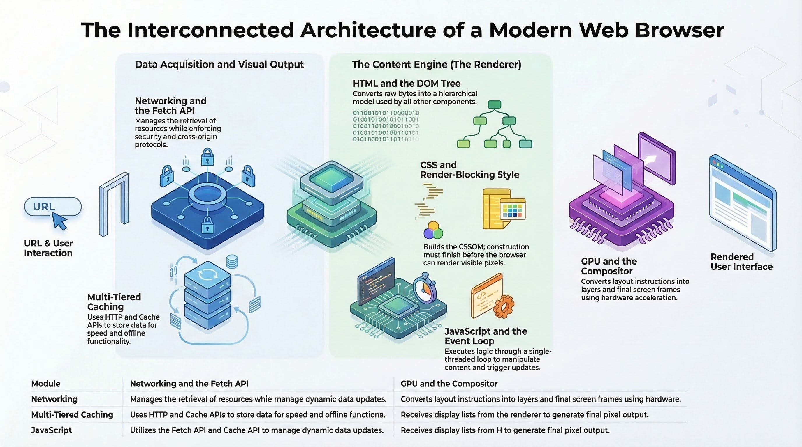

The actual writing of code hasn't been the bulk of development for a while, particularly in larger companies with larger codebases and existing users. The more existing users there are, the more process there tends to be around protections and procedures to make sure you aren't breaking existing behaviors, risking security (or press) or causing regressions in some random metric that was added to the launch process at some point in the life of the product.

This is all in place for a good reason but it also significantly reduces the velocity of development for the product involved. For extremely complex products (like, say, a web browser) this isn't necessarily a risk to the product itself because the ROI for a new competitor to build a full browser from scratch has been astronomical. This is why there has been so much consolidation in browser engines and why most new "browsers" are just reskinned versions of Chromium.

That has all changed in the last year or so as LLMs have gotten much better at writing code.

## Web browsers are prime candidates for disruption

I have a lot of history in the web browser space so it's one that I'm most familiar with (though I also have plenty of exposure to other huge projects with large legacy user bases).

A clean-sheet web browser is a perfect candidate for being built with AI:

- Virtually every part of the stack is heavily specified and documented (WHATWG, W3C, IETF, TC39, etc.)
- There are at least 3 modern, independent open-source rendering engines (Blink, Gecko, Webkit) that can be used as a reference and for validation.
- There are multiple open-source implementations of Javascript (V8, SpiderMonkey, JavaScriptCore) that can be used as a reference and for validation.
- There are interop tests for testing common web features.
- There are tests within each browser implementation for their implementations of web features.
- There are billions of pages on the web that can be used to test against both existing implementations and any new ones.

If you are getting into the market or need a web rendering engine for your product (embedded or otherwise), are you better off building a new one from scratch that is purpose-built for your needs or trying to shoehorn an existing engine into your product?

I'd hazard a guess that for most use cases the answer is now (or will soon be) "build a new one from scratch".

## What would be involved in building a new web browser?

Browsers have some pretty clear components that basically stand-alone and have well-defined interfaces into the other parts of the system:

For the most part, you can break each of those pieces into a stand-alone project once the interfaces are defined and iterate on building them independently.

For each of the components, you can iterate on an implementation with an LLM, probably somewhat autonomously with a feedback loop based on the huge corpus of existing tests. You'd probably start by building isolated tests for each of the existing engines to use as a point of comparison.

## Built for your needs

With an engine that is built to your specific needs, you can tune and optimize it in ways that are simply not possible when building on top of an existing engine.

Want better memory-safety guarantees? Have the agents build it in Rust from the ground-up and minimize the use of unsafe operations.

You can target specific architecture assumptions without the legacy baggage of supporting decades of hardware. For example:

- You could require a hardware GPU with a minimum feature set and eliminate the software rendering path entirely. 
- You could target modern CPU architectures with SIMD support.
- You could target operating systems with specific isolation and memory safety features.

You can also strip out all of the features that don't make sense for your use case:

- Want to run headless? No need for a UI.
- Don't need dev tools? Don't include the layers of hooks that they require.
- Targeting a specific embedding case? You can strip out everything that isn't required for that use case.

## Competitive advantages

Beyond the platform-targeting advantages, you can also optimize it for your specific needs, making the tradeoffs that make sense for your use case between performance, memory size and binary size (and optimize for specific metrics).

Once you have a functional implementation, you could leverage something like [AlphaEvolve](https://deepmind.google/blog/alphaevolve-a-gemini-powered-coding-agent-for-designing-advanced-algorithms/) to optimize it well beyond what any existing browser implementations are capable of.

My guess is you could easily build a browser that is twice as fast as the current browsers, uses half of the memory with a binary size a fraction of what the browsers currently ship and do it with a relatively small team (with a generous token budget).

## Not just browsers

This largely holds for any large software project that has an existing large user base. The barrier to entry for building a new implementation that is purpose-built has dropped significantly and the risks of "process" slowing down development are going to become a huge problem for existing players in a lot of markets.