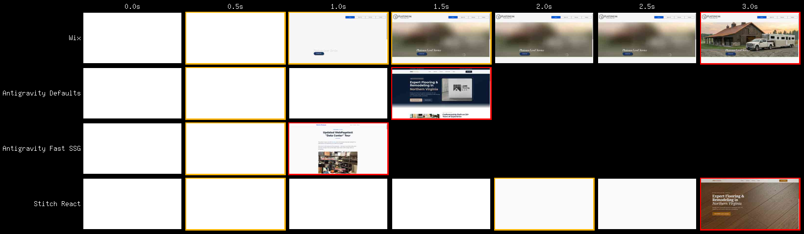
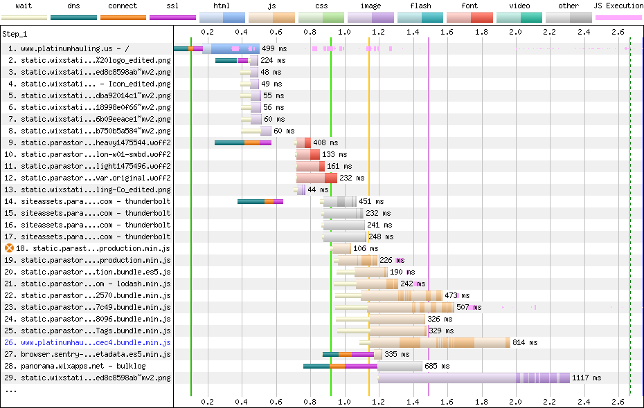
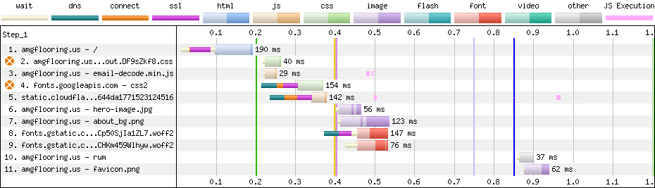
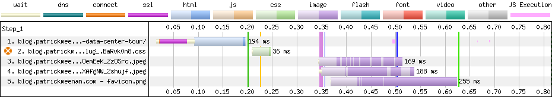
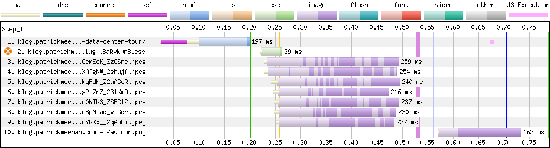
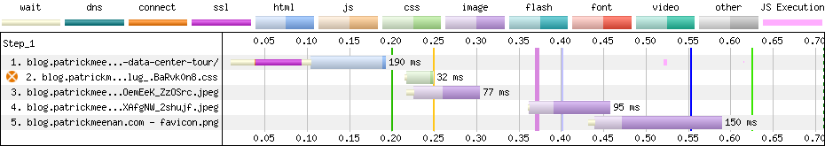
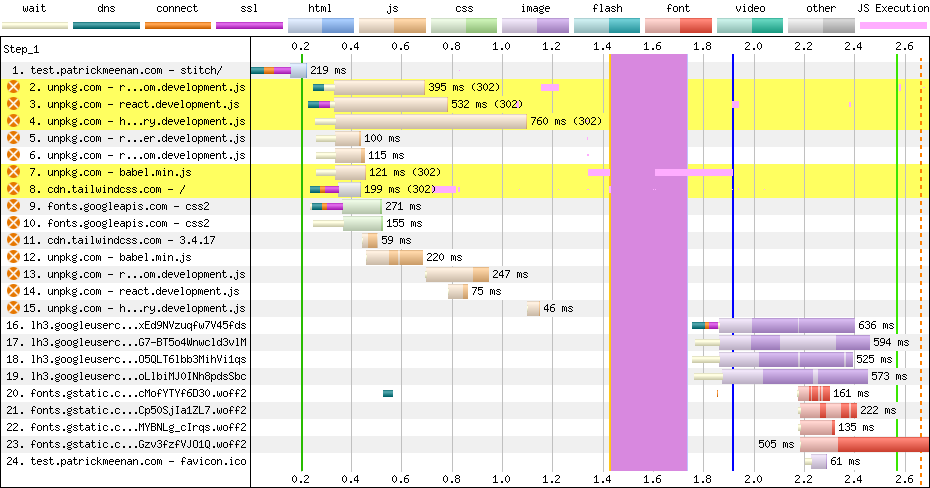

I've used AI to generate a few websites over the last month or so and not too long before that I was helping my son create a website on Wix so I thought it might be interesting to see how they stack up against each other in terms of performance. I was REALLY motivated when I saw the new [Stitch app](https://stitch.withgoogle.com/) had a "create react app" button (ok, petrified probably describes my reaction better than motivated).

## The contenders

The first site I helped with was a [Wix website](https://www.platinumhauling.us/) for my son's horse transport business. I directed him there since he could build most of it himself and I knew the Wix team works hard to make their sites fast (within the constraints of running a giant self-publishing framework). We spent a fair bit of time on getting the layout to "mostly work" but the grid system is pretty limiting so we ended up with a design that was "good enough" rather than "great". He did most of the work though so I'm happy with that part of things.

The next site was a [site](https://amgflooring.us/) that I promised a contractor that we use a lot that I could help him put together. I've been meaning to play with 11ty and other frameworks for a while but the level of effort has always been more than I wanted to take on and I have zero design skills (less than zero if that's possible). I figured it was a good time to see how far AI has come since I last used it with Gemini 3.0 (which didn't go great but was decent for spec work) and both Gemini 3.1 and [Antigravity](https://antigravity.google/) had just come out so it felt like the perfect time to give it a shot.

This was a breath of fresh air and probably the best experience I've ever had with a dev tool for building websites. I basically just told it the pages that I wanted to include, some details about the business, the features I wanted the website to have and that I wanted it to be statically hosted (and preferably served from cloudflare pages). It built a beautiful, functional site in just a few minutes. Some of the things didn't work quite right but I just told it what needed to be fixed and it took care of it. It had used some stock photos served from third-party sites as placeholders and I had it use Nano Banana Pro to generate better ones (and to self-host them) and had it generate photo galleries using actual photos he provided me.

I had to ask it to automate resizing and optimizing of the images but, to this day, I haven't had to touch a line of the source code for the site. I was even lazy enough to ask the AI to change some text on the page instead of doing it myself. It created a nicely responsive site that performed well and took just a few hours of effort from end to end. It picked Astro as the framework to use and it may need some more tweaks to fix things as they come up (like I haven't checked how accessible it is yet) but it's WAY better than I could have done on my own.

The third site I built was to migrate this blog off of blogger (again, with Antigravity and Gemini 3.1 pro thinking). I won't get into all of the details because I already [wrote a post](https://blog.patrickmeenan.com/2026/02/27/its-alive/) about it but this time I was more specific about wanting it to generate a fast SSG website that defaults to plain HTML and only uses JS as a progressive enhancement. I asked it to build it so that I could author articles in markdown and for it to migrate all of the existing content.

Again, a few hours of work produced something I'm really happy with and is way better than I could have done by myself. I've had to go back a few times to ask it to add features (like OG meta tags for post embedding, an RSS feed, etc) but that was all done through prompts. I write all of the markdown files for the articles by hand but I haven't touched a line of the framework code that turns it into the blog (Astro again).

The [final one](https://test.patrickmeenan.com/stitch/) I wanted to look at was a quick test with using Stitch to generate a react app. I spent maybe five minutes on it because it's just for testing purposes and I asked it to scrape the content from the contractor website and redesign it. I'm not the target audience for the tool so I didn't spend any time on the design itself of the functionality of the app other than to make sure it worked because I was mostly interested in seeing how the code it generated performed.

## How did they do?

I was really impressed with both of the Astro sites that Antigravity generated. They handily beat the performance of the Wix and Stitch-generated sites and served plain HTML with a side of progressive enhancement.

To be fair, they aren't all serving the same content and the Wix page has a massive background image but they're relatively comparable and the waterfalls clearly show that the performance differences aren't because of the content.

### Wix

The Wix site is surprisingly fast given how much it loads but even for the above-the-fold content it is pulling resources from 4 different domains and relying on a fair bit of JS:

That is the trimmed-down version just to get to the LCP image. The [full waterfall](https://webpagetest.httparchive.org/result/260320_A0_1/1/details/#waterfall_view_step1) is 174 requests and 2MB of content, most of which is Javascript (11MB uncompressed JS).

### Antigravity - Contractor website

This, I was thrilled with:

It looks like it loads ~600 bytes of JS to help with email address decoding (from the mailto: link I assume) and pulls fonts from Google fonts but, otherwise it's just the HTML, CSS and images for the content itself. ~200KB all-in and 9 requests. Most of that is from the fonts and images. At some point I should have it inline that javascript and self-host the fonts but I'm thrilled with the result.

### Antigravity take two - My blog

I picked an article page with a visible image to make it fair(er) but it [knocked it out of the park](https://webpagetest.httparchive.org/result/260320_VX_3/):

No javascript, no custom fonts, just the HTML, CSS and images for the content itself. The one thing that did jump out at me was the late loading of the images including the hero image. It looks like Astro defaults to `loading="lazy"` on all images so I just went back and asked Gemini to fix that.

My [first attempt](https://webpagetest.httparchive.org/result/260320_7S_5/1/details/#waterfall_view_step1) was a little too heavy-handed and I removed lazy loading from ALL images which made things a bit worse since it would load all of the images in parallel (though, at least starting sooner):

The [third time](https://webpagetest.httparchive.org/result/260320_KK_6/) was the charm:

Now it loads the first image in any blog post eagerly, in parallel with the CSS, and then lets native lazy-loading take care of any subsequent article images.

The visual experience isn't meaningfully different since it still has to go through the layout/style/render pipeline before displaying it to the screen but the browser now has what it needs to display the above-the-fold content ~40% sooner (and I feel better about myself).

### Stitch react app

Yeah, it's about what I expected. See if you can tell when the app hydrates:

It doesn't actually display anything on the screen until well after the waterfall finishes (while the client-side rendering is being applied). It doesn't help that every one of the react requests is redirecting from a generic major version to a specific patch version. The actual weight of the JS isn't as bad as I worried it might be (11 requests, ~625KB compressed) but it's ALL render blocking.

Here's hoping people take the export options of the MCP or project brief and feed it into something else to build the actual websites and don't try going straight to production with the built-in react app. It's great for getting a feel for how the app would work but not much else.

## Conclusion

I'm really excited for where this journey is taking us. I think the ease-of-use for generating websites directly instead of using a CMS is going to be a game-changer and it will be interesting to see how the market evolves.

That said, the tools still need a lot of help and are "tools". They remind me of a conversation I had with a product manager years ago about their site performance. He had assumed that the dev team would "just make it fast" and that it wasn't something he should have asked them to focus on. It feels like AI is at a similar place and our role is basically the same. It CAN make things fast, responsive, accessible, etc., but it might not unless you specifically tell it to.