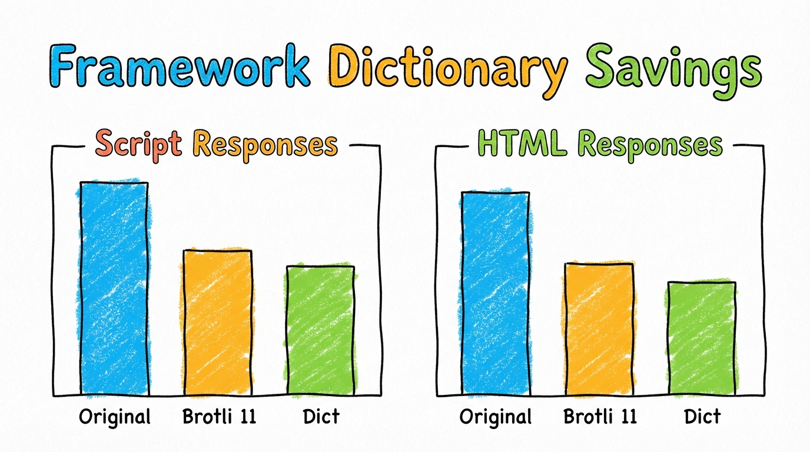

Should we ship jQuery, React and other popular frameworks with browsers so sites don't have to re-download the same frameworks over and over?

## Some background

For years, web performance advocates have casually suggested that browsers should "just ship jQuery" or other popular frameworks to avoid the need for every site to force users to re-download identical library code (there's a recent WHATWG discussion on it [here](https://github.com/whatwg/html/issues/239)). 

However, this concept has historically faced several fundamental hurdles.

First, there is a massive variety of framework versions in active use across the web, making it almost impossible to select a single "canonical" version.

Second, sites must be able to react quickly to security vulnerabilities, and being "locked" to a browser-shipped version could seriously hinder necessary updates.

Finally, these frameworks are served from a wide array of domains and are frequently bundled with site-specific code, which completely breaks simple URL-based caching.

## Proposal: A Web-Wide Compression Dictionary

[Compression dictionary transport](https://www.rfc-editor.org/rfc/rfc9842.html) brings an interesting possible solution to this problem. Instead of shipping raw library binaries, we could ship a versioned compression dictionary (e.g., a "2026 web" dictionary) that includes common frameworks like React and jQuery. This is basically the modern alternative to the old "Built-In Web Libraries" approach.

Unlike the whole bundling approach—which struggled with the sheer variety of library versions and the risk of making certain versions "sticky" and slowing down security updates—a compression dictionary provides a wonderfully transparent mechanism. It allows servers to compress their unique resource bundles against the shared dictionary, gaining cross-site sharing benefits without requiring developers to change their HTML or worrying about being locked into a specific binary version. The dictionary natively supports versioning and avoids the privacy risks or other concerns associated with traditional shared library caching schemes.

Since libraries tend to change pretty incrementally over time, a single version of jQuery, React, or other commonly used code can actually compress other versions of the same library really well, eliminating the need to match a site’s specific version.

Even better, the proposal leverages the existing Compression Dictionary Transport mechanism and the `Available-Dictionary` request header for seamless backward compatibility and easy deployment. The browser would just advertise the web-wide dictionary as being available when a better, content-specific dictionary is not.

## Methodology: Building the Dictionary

So how do we build it? The 50MB dictionary was constructed by analyzing massive amounts of public web data pulled as part of the HTTP Archive crawl. For this run, the crawl was updated to parse all of the Javascript it encountered, extract each top-level comment and function block, and store them in the `crawls_staging.script_chunks` table along with the hash of the payload and the URL it was served from.

*(The code for generating and testing the dictionary is up on Github in the [web-dictionary](https://github.com/pmeenan/web-dictionary) project).*

We counted the unique occurrences of those hashes across different URLs and pulled the script chunks that were seen on at least 10,000 different URLs. That yielded around 10,300 highly pervasive script or comment blocks. A deduplication pass was then used to ensure that similar functions—such as those across different versions of the same library—were compressed against each other. This was purely to minimize the dictionary size while maximizing utility. The [resulting dictionary](https://github.com/pmeenan/web-dictionary/raw/refs/heads/main/data/202603.dict) is around 50MB and works with both Brotli and ZStandard.

The tested dictionary contains a lot of the typical boilerplate copyright blocks as well as the frameworks you’d normally expect to see out there (jQuery, jQueryUI, React, Preact, Angular, etc.), plus a lot of underlying code that is widely reused.

## Methodology: Testing the Dictionary

To actually test the effectiveness of this beast, I pulled the list of script and HTML requests that were loaded by the top 100,000 pages from the March HTTP Archive crawl. That resulted in ~3 million unique URLs. 

I then fetched the URLs independently to keep BigQuery costs in check (even though the HTTP Archive has the original bodies) and re-compressed them twice: once with Brotli level 11, and once with Brotli level 11 plus the 50MB dictionary. The original encoded size as-served from the origin was also logged, and then the relative sizes were compared for analysis.

## Experimental Results

I stopped the processing at ~400k URLs (70% scripts, 25% HTML) because the data converged really quickly and wasn't changing as more URLs were processed.

Here's how the savings looked:

### Script Metrics
- **Brotli 11 Savings over Original:** saved 16% (11 KB).
- **Brotli 11 + Dict Savings over Original:** saved 29% (15 KB).
- **Brotli 11 + Dict Savings over Brotli 11:** saved 15% (4 KB).

### HTML Metrics
- **Brotli 11 Savings over Original:** saved 35% (8 KB).
- **Brotli 11 + Dict Savings over Original:** saved 55% (9.5 KB).
- **Brotli 11 + Dict Savings over Brotli 11:** saved 27% (1.7 KB).

## Conclusion

While the inclusion of a 50MB framework dictionary does offer some really great compression benefits—particularly for HTML and certain classes of scripts—the overall conclusion is that it's just not yet worth the effort right now.

Managing a 50MB static dictionary on every single client device and growing adoption of server-side compression with the same dictionary is a fairly long and drawn-out process.

Given that just using Brotli 11 compression alone already provides significant savings over what most websites are currently serving (and tuning their compression is exactly what we'd have to do for the dictionary support anyway), the most effective path forward is to encourage broader adoption of Brotli 11 well before we start introducing the overhead of a browser-shipped web-wide dictionary.
