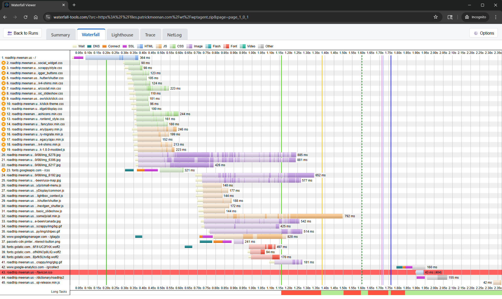
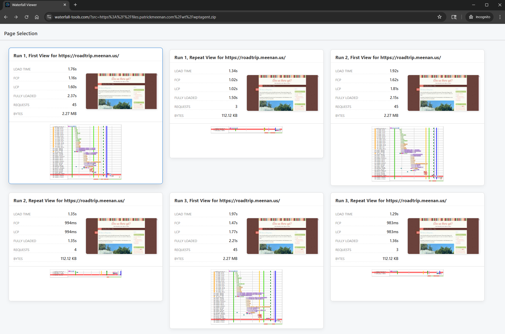
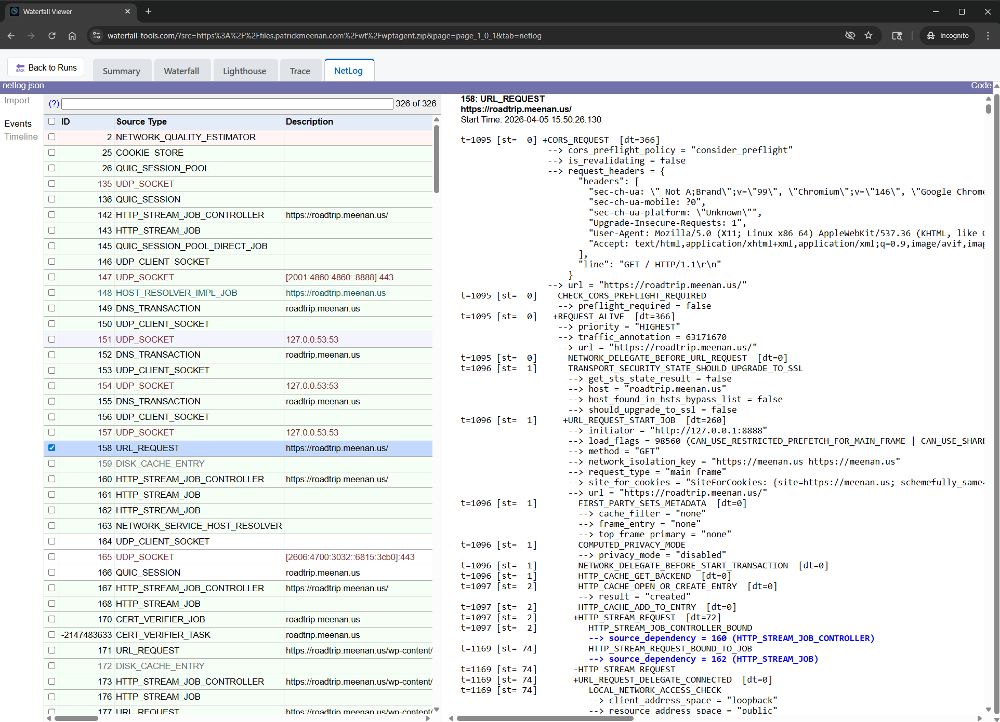
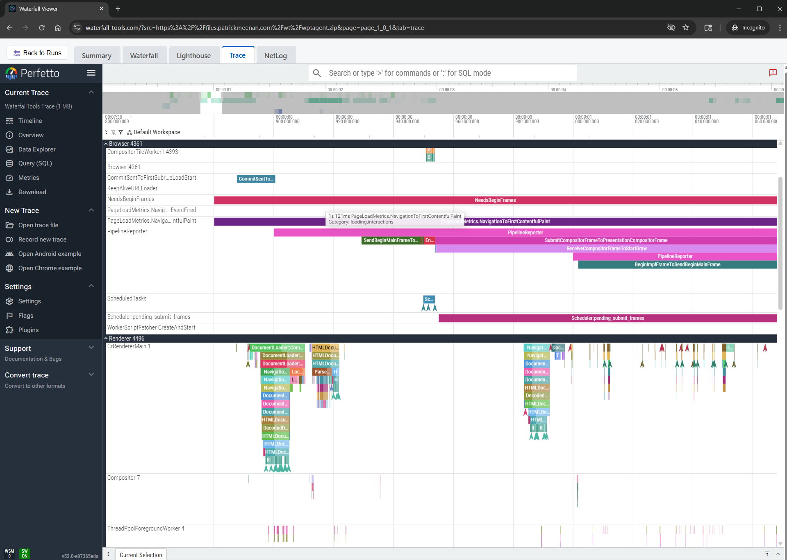
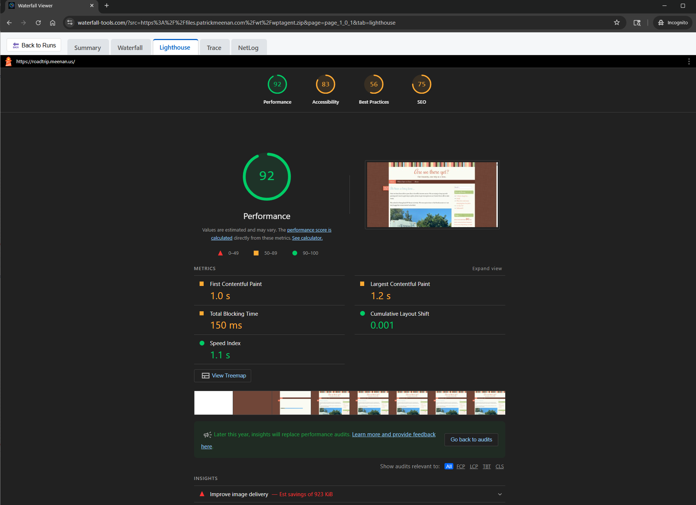
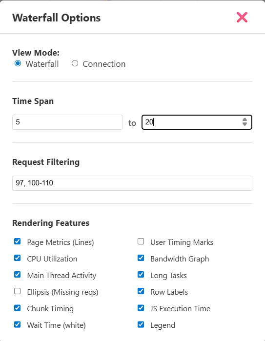
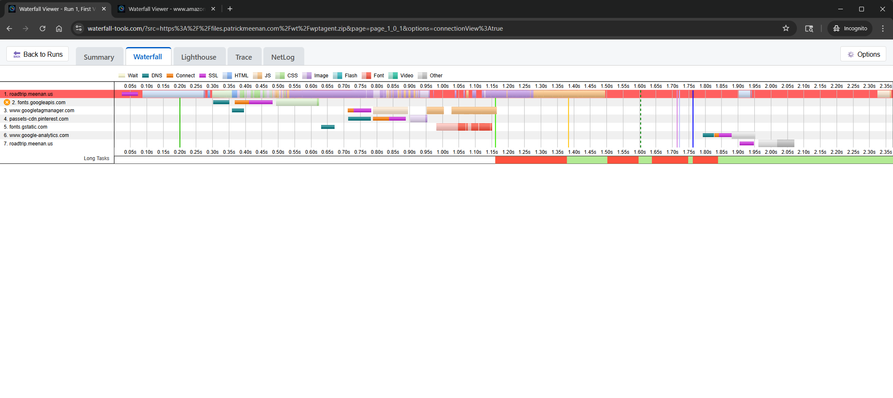

I've been wanting to build a 100% client-based waterfall tool for a long time. Something with a much more modern rendering engine and UI than WebPageTest's server-side php-based image waterfalls. It's a fairly big project though and I never had the time to invest into it but that all changed with the advance of the AI-assisted development tools (I refuse to use the term "vibe coding" given the amount of actual engineering that went into it).

Today, I bring you [Waterfall Tools](https://waterfall-tools.com/)!

## What is it?

Waterfall Tools is a JS library that provides the necessary logic for ingesting a HUGE variety of data formats, extracts the waterfall page and request data, and provides interfaces for rendering it using canvas into a container that you provide. It provides hooks for interacting with the waterfall (hover, click and request data) so you can build a full viewer.

It ALSO provides a full viewer that can be embedded in an iFrame or loaded directly with query params that allow you to control the behavior and provide a source URL for the data to be rendered.

As a stand-alone viewer, it can work completely client-side and you can drag and drop an appropriate file onto the viewer and it will provide a rich view of the details of the request data, a WebPageTest-style waterfall and integration with other tools like Perfetto and Chrome's netlog viewer, all within the client UI.

It can run completely offline with service worker support.

If the source data is loaded from a URL, the resulting waterfall view is sharable, down to the specific view you are looking at.

It supports multiple pages within a single data source (e.g. a WebPageTest agent run with multiple pages, or a HAR file with multiple pages).

The canvas-rendered waterfalls can still be copy/pasted or directly saved as images so they can still easily be dropped into documents and presentations.

## What formats does it support?

Waterfall Tools supports every format I could think of to implement and supports adding more as needed. The current list includes:

- WebPageTest agent (wptagent) raw test results ([sample](https://waterfall-tools.com/?src=https%3A%2F%2Ffiles.patrickmeenan.com%2Fwt%2Fwptagent.zip))
- WebPageTest JSON ([sample](https://waterfall-tools.com/?src=https%3A%2F%2Ffiles.patrickmeenan.com%2Fwt%2Fwpt.json.gz))
- WebPageTest HAR files (including those from the HTTP Archive) ([sample](https://waterfall-tools.com/?src=https%3A%2F%2Ffiles.patrickmeenan.com%2Fwt%2Fwebpagetest.har.gz))

- Chrome Netlog captures ([sample](https://waterfall-tools.com/?src=https%3A%2F%2Ffiles.patrickmeenan.com%2Fwt%2Fnetlog.json.gz))
- Chrome Trace capture (in both perfetto protobuf and JSON formats) ([sample](https://waterfall-tools.com/?src=https%3A%2F%2Ffiles.patrickmeenan.com%2Fwt%2Ftrace.perfetto.pb.gz))
- Chrome HAR files ([sample](https://waterfall-tools.com/?src=https%3A%2F%2Ffiles.patrickmeenan.com%2Fwt%2Fchrome.har.gz))
- Firefox HAR files ([sample](https://waterfall-tools.com/?src=https%3A%2F%2Ffiles.patrickmeenan.com%2Fwt%2Ffirefox.har.gz))

- Raw tcpdump captures (with keylog files for TLS decryption) ([sample](https://waterfall-tools.com/?src=https%3A%2F%2Ffiles.patrickmeenan.com%2Fwt%2Ftcpdump.pcap.gz&keylog=https%3A%2F%2Ffiles.patrickmeenan.com%2Fwt%2Ftcpdump.keylog.txt.gz))

I'm particularly excited about the tcpdump support. It handles:

- Decoding the capture files
- Building the TCP and UDP streams
- Decrypting TLS traffic using the keylog file (including QUIC TLS1.3)
- Extracting HTTP/1.x, HTTP/2 and HTTP/3 requests and responses (including HPACK and QPACK decoding)
- Decoding DNS traffic
- Decoding DNS over HTTPS (DoH) traffic
- Decoding DNS over TLS (DoT) traffic
- Extracting response bodies
- Decompressing `gzip`, `zstd` and `br` content-encodings

All in 100% vanilla javascript leveraging browser APIs where possible.

## Request Details

Clicking on any request in the waterfall will open (or focus) a closable tab with the request details that you're used to seeing in WebPageTest's pop-up dialogs.

")

Including syntax-highlighted response bodies for text-based content types.

")

## Embedded Viewers

Beyond the directly-owned UI for rendering the waterfalls and request data, the viewer also integrates with other tools for relevant formats depending on what the test data includes.

For example, if the data source is a Chrome netlog or the test data includes a captured netlog, the viewer provides a "Netlog" tab that embeds the Chrome Netlog Viewer to provide a rich view of the network traffic.

Similarly, if the data source is a Chrome trace or the test data includes a captured trace, the viewer provides a "Trace" tab that embeds the Perfetto UI to provide a rich view of the trace data.

If the test data includes lighthouse results, the viewer embeds the lighthouse result in a "Lighthouse" tab.

## Waterfall customization

The waterfall rendering is highly configurable and you can control all of the things you are used to being able to control in WebPageTest's waterfall viewer and then some.

I'm particularly happy that we can now, FINALLY, adjust the start time of the waterfall to zoom in on a section in the middle of a waterfall. This is something that has been requested for years for WebPageTest and I'm glad we can provide it here.

The connection view and data charts below the waterfall are also supported including request-specific details as you hover over or click on the individual chunks in the connection view.

## How big is it?

I made the conscious decision to focus on a vanilla javascript project that requires "modern" browsers and went with a full javascript application including a lot of the UI. A lot of the core functionality requires it anyway and it wouldn't make sense to try to jump through hoops to use native browser elements and css for things like the waterfall rendering.

The core library is split into 3 pieces (all sizes are reported in compressed wire-sizes):

- **40 kB** : The core waterfall tools JS (which includes support for parsing all of the formats except tcpdump and the canvas rendering engine)
- **17 kB** : The tcpdump parser including all of the decryption and decoding logic and everything except for JS-based Brotli decompression.
- **59 kB** : Javascript-based Brotli decompression (for browsers that don't support `DecompressionStream('brotli')`)

The tcpdump and Brotli support are loaded on-demand as-needed (and hopefully the Brotli support can go away entirely over time as browsers add native DecompressionStream support).

The Viewer UI has a few pieces between the HTML, CSS, JS and logo image. All-in, that comes in at around **25 kB** for the viewer UI. 

The viewer bundles the Chrome Netlog viewer if you want to be able to view netlogs in the native viewer and it is a bit of a pig, relatively speaking at 170 kB.

For a core Waterfall client supporting everything except for tcpdump import and without built-in netlog viewing, that comes in at around **65 kB**. 

I'm sure it will grow over time as more features are added but I'm very happy with that for the level of functionality it provides.

## Free and Open Source

The project is as unburdened with licensing as possible. The code and all of it's dependencies are under Apache 2, MIT, BSD or equivalent licenses, allowing you to do anything you want with it (including commercially).

You can find the repository here: [https://github.com/pmeenan/waterfall-tools](https://github.com/pmeenan/waterfall-tools)

Please file issues for anything you see that is broken or that you'd like added or changed and contributions are welcome.

The project is designed to be developed with the help of AI coding assistants with a running set of agent instructions in AGENTS.md (and referenced from CLAUDE.md) so they should be picked up automatically.

The viewer is available at [https://waterfall-tools.com](https://waterfall-tools.com) and you can play with it right now with the samples linked above or by dragging and dropping your own files onto the page.

## What's Next?

There are still a lot of features I'd like to add and I'm sure there are a lot of edge-case bugs that still need to be fixed (what is there now is the result of about a week's worth of weekends and evenings).

Some of the things on my TODO list include:

- Filmstrip view (this is a big one)
- "All images" view that shows all of the images that were loaded and any optimization opportunities
- Console log in the Summary tab
- More metrics extracted from the tcpdump, netlog and Chrome trace files

The results viewing is also just a lego piece in a full testing pipeline. I'd like to see if I can connect the viewer directly to local test tooling like wptagent's CLI, Puppeteer, Playwright, Crossbench, etc. so that you can run tests locally and view the results in the viewer without having to upload files to a server.

It could also be interesting to hook up to a simple test queuing system that runs tests on remote infrastructure, using something like the old WebPageTest API to submit jobs and get results back.

If you chain that with persistent storage somewhere, you basically have a full synthetic testing pipeline with swappable pieces.