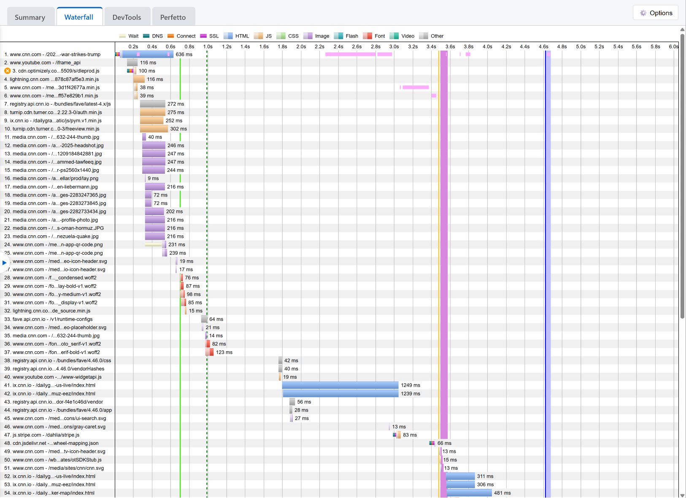
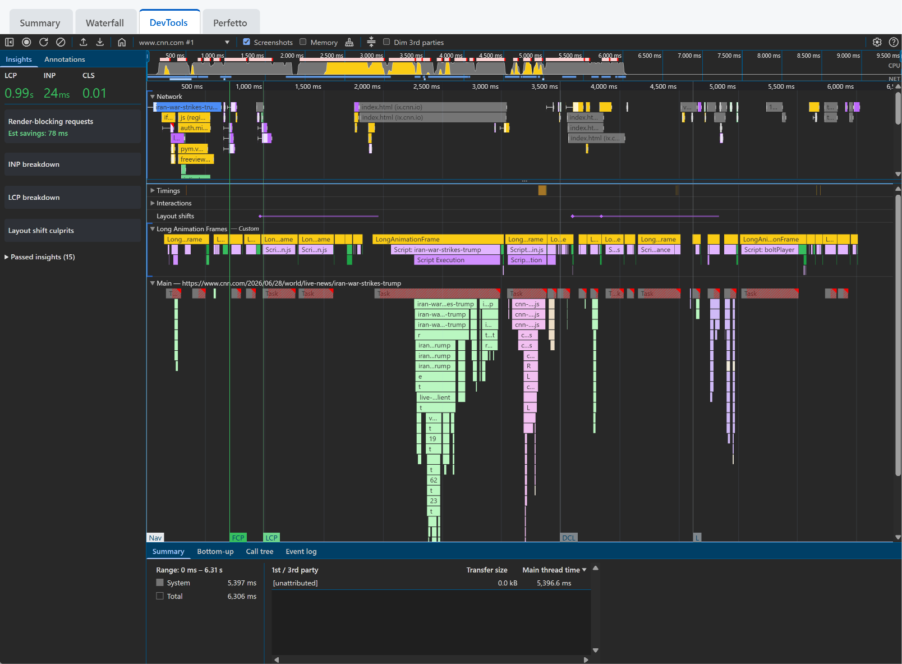
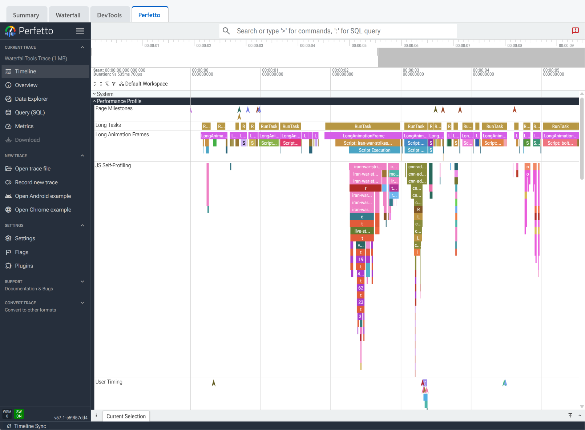

Ever since browser vendors started exposing advanced performance telemetry APIs directly to the page, like the [Performance Timeline](https://developer.mozilla.org/en-US/docs/Web/API/PerformanceTimeline), [Long Animation Frames (LoAF)](https://developer.mozilla.org/en-US/docs/Web/API/Long_Animation_Frame_Timing_API), and the [JS Self-Profiling API](https://developer.mozilla.org/en-US/docs/Web/API/JS_Self-Profiling_API), I've been waiting for tooling that could capture, store, and visualize all of this data in the wild. We can gather incredibly detailed information about what is happening on a user's machine, but adoption of the profiling side of things has been pretty light from what I can tell (and the lack of tooling doesn't help).

When I introduced [Waterfall Tools](https://waterfall-tools.com/) a few months ago, the goal was to build a client-based canvas rendering engine for synthetic test waterfalls. But it also laid the groundwork for a field-data viewer. We just needed a way to package, compress, and feed that data into it.

So that's what I built. Say hello to **rumcap**: a file format and helper library for collecting, compressing, and visualizing RUM performance data.

## Half the Size of Gzipped JSON

Besides just being a well-defined way to format the data for consumption, the main benefit of `rumcap` is how well it compresses.

When you capture raw performance timelines, resource entries, call stacks, and JS profile samples, the raw data is highly repetitive. You have the same domains, similar resource paths, repeated function names, and overlapping execution call stacks. If you just grab these events as JSON and gzip them, you still end up with relatively large payloads.

`rumcap` serializes the data into an extensible binary format that is optimized to compress well (and gzip compression is applied as part of the packaging). 

The result is a `.rumcap` binary file that is typically **half the size of the equivalent raw events gzipped**. By profiling standards the files are tiny (in the neighborhood of 10 KB for a typical page view with full request data and JS self-profiling enabled), making rich telemetry viable for real-user monitoring.

## Visualization In Waterfall Tools

To support this new format, `waterfall-tools` has been updated with native `rumcap` support, exposing the data in the regular waterfall view as well as the embedded Chrome DevTools viewer and Perfetto trace viewer (with whatever event data was included in the capture restructured into the correct format for each):

1. **Waterfall View**: A classic network waterfall timeline showing all resources, including visual markings for key performance metrics (FCP, LCP) and Long Animation Frames (LoAF).



2. **DevTools View**: Chrome's DevTools performance panel with data for the requests, page-level timings, call stacks, user-timing events, and more.



3. **Perfetto View**: An embedded Perfetto trace viewer for slicing and dicing the JS profile samples alongside main thread activities (with the request details and timings preserved as well).



If your profile includes JS self-profiling data, you can view the call stack flame charts side-by-side with resource requests and LoAF blocks to see exactly what script blocked the thread. It also supports [User Timing marks and measures](https://developer.mozilla.org/en-US/docs/Web/API/User_Timing_API), as well as custom stacked event durations so you can map your own trace instrumentation into the timeline.

## What rumcap is NOT (and What it is)

To be clear, **rumcap is not a full end-to-end RUM stack.** 

It does **not** provide:
- A full analytics/beaconing library (which projects like Boomerang are already great at).
- A collection backend or aggregation infrastructure.
- A visualization dashboard.
- Any aggregation across events.
- The logic to decide *when* to trigger profiling (since JS self-profiling does have runtime overhead, you definitely shouldn't capture a full trace on every single page view).

`rumcap` provides a well-defined format for storing the data (efficiently), an encoder/decoder library, and the visualization tools. The goal is to make it easy for existing RUM providers and in-house performance infrastructure to start collecting and displaying developer-friendly trace views.

## In-Page Example

Integrating `rumcap` to capture events and profile JS on your page is designed to be as simple as possible, providing a sink that you can pipe PerformanceObserver and Profiler events directly into.

```html
<script type="module">
  import { Encoder, entrySink, environmentSnapshot } from '/js/rumcap.js';

  const encoder = new Encoder();
  encoder.setEnvironment(environmentSnapshot());

  // Connect PerformanceObservers directly to the encoder sink
  const sink = entrySink(encoder);
  const entryTypes = [
    'navigation', 'resource', 'paint', 'largest-contentful-paint', 
    'layout-shift', 'event', 'first-input', 'longtask', 
    'long-animation-frame', 'element', 'mark', 'measure'
  ];
  for (const type of entryTypes) {
    try { new PerformanceObserver(sink).observe({ type, buffered: true }); } catch (e) {}
  }

  // Start JS Self-Profiling if supported
  let profiler;
  if (window.Profiler) {
    profiler = new window.Profiler({ sampleInterval: 10, maxBufferSize: 30000 });
  }

  window.addEventListener('load', () => {
    setTimeout(async () => {
      if (profiler) {
        try {
          const profile = await profiler.stop();
          encoder.addProfilerChunk(profile, profiler.sampleInterval);
        } catch (e) {}
      }

      const bytes = await encoder.finish();
      // navigator.sendBeacon('/rum', bytes);
      console.log('Captured rumcap size (bytes):', bytes.byteLength);
    }, 1000);
  });
</script>
```

## Demos

Here are a few sample captures from production pages in the Waterfall Tools viewer (all captured at 6x CPU throttling to show more interesting events):

- [cnn.com](https://waterfall-tools.com/?src=https%3A%2F%2Ffiles.patrickmeenan.com%2Fwt%2Fchrome-www-cnn-com-cpu6x.rcap)
- [Vercel's v0 landing page](https://waterfall-tools.com/?src=https%3A%2F%2Ffiles.patrickmeenan.com%2Fwt%2Fchrome-v0-app-cpu6x.rcap)
- [Etsy](https://waterfall-tools.com/?src=https%3A%2F%2Ffiles.patrickmeenan.com%2Fwt%2Fchrome-www-etsy-com-cpu6x.rcap)
- [Google Finance](https://waterfall-tools.com/?src=https%3A%2F%2Ffiles.patrickmeenan.com%2Fwt%2Fchrome-www-google-com-cpu6x.rcap)

## Open Source & Libraries

All parts of both projects are free, open-source, with Apache 2.0 licenses and available on GitHub and npm:

- **rumcap**: Available on [GitHub](https://github.com/pmeenan/rumcap) and [npm](https://www.npmjs.com/package/rumcap).
- **waterfall-tools**: Available on [GitHub](https://github.com/pmeenan/waterfall-tools), [npm](https://www.npmjs.com/package/waterfall-tools), and hosted at [waterfall-tools.com](https://waterfall-tools.com/).

Feel free to play around with the tools, try it out, and share your feedback on GitHub (issues and PR's happily accepted)!
