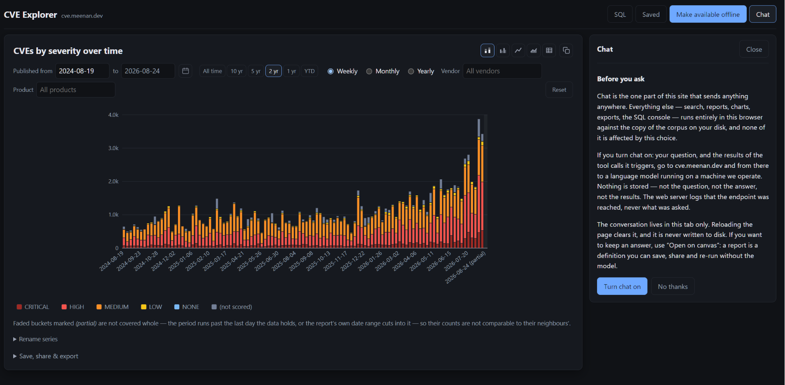
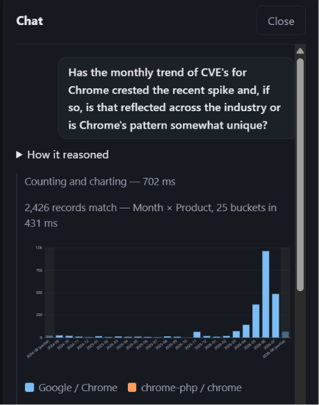
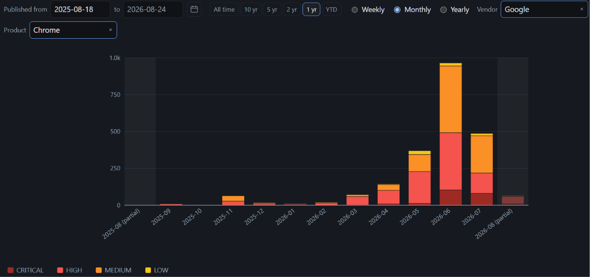
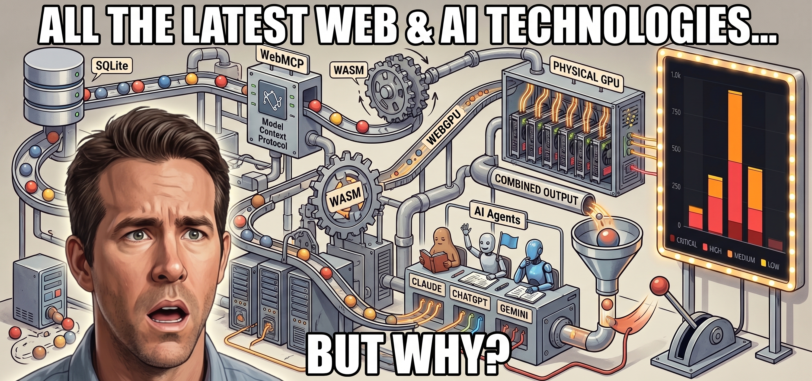

Like most of [my recent projects](https://www.meenan.dev), it started out with an itch I wanted to scratch so, instead of just answering the question I wanted answered, I WAY over-engineered a solution and used AI to build something instead.

In this case, the question I had was: "Are we seeing a shift in CVEs after the initial post-Mythos spike to fewer critical CVEs as the backlog of undiscovered issues is cleared out?" On the receiving end in Chrome it kind of felt like we had crested a wave but I wasn't sure if that was just my little pocket of the world or applied more broadly.

I started by looking for a tool that I could just query and see what the history looked like, and maybe my search-fu is just weak, but all of the tools I could find pretty much sucked. And, to top it off, the [CVE Dataset](https://github.com/CVEProject/cvelistV5) is a GitHub repository of JSON files - not exactly conducive to running a quick analysis.

So I built [CVE Explorer](https://cve.meenan.dev/).

## The Original Plan

Originally I had planned to build an in-browser visualization tool using a local sqlite representation of the dataset but, instead of making the user manually filter and select from a representation that I picked, give them a chat bot that had access to the sqlite dataset as well as graphing tools to represent the results. I ended up with a bit of a hybrid, allowing for some quick manual filtering but the core of the idea landed. The devil is in the details though.

## Sqlite dataset

The original plan was 100% in-browser using [Origin Private File System](https://developer.mozilla.org/en-US/docs/Web/API/File_System_API/Origin_private_file_system) (OPFS), wasm and sqlite and that is still supported with a full sync and local analysis but the friction seemed a bit high if someone had a casual question they wanted answered quickly so I caved and also added a server-queryable sqlite dataset.

At this point I've used WASM, OPFS and sqlite in a few of the hobby projects and it works incredibly well, running in worker threads, off of the main UI thread and with good performance. Probably not something I'd want to target at low-end mobile devices but for my developer desktop target demographic, it's fine.

## Charting engine

Originally I had expected to use an off-the-shelf library or [d3.js](https://d3js.org/) since those have been my historical methods for dropping charting support into a tool quickly, but the agents convinced me that it would be just as easy to build something custom with svg and I could make it do exactly what I wanted it to do without being bound by the library.

I added support for stacked and grouped bar charts, line and area charts and data tables figuring that should cover every way someone would want to visualize the underlying data. It was also important that there be a "copy as png" button to make it easy to share the resulting visual.

It's not particularly feature-rich but it does exactly what I needed it to do and let me offer things like interactive hovering, hiding series by clicking the labels, shading "partial" data columns (like the current month), etc.

## In-app AI chat

This is where there was the most churn (probably not surprising). There are a bunch of ways of integrating a chatbot (with tool calling) that I considered:
- In-browser model using WebGPU and WASM.
- Chrome's [Prompt API](https://developer.chrome.com/docs/ai/prompt-api).
- Leverage the Google cloud credits key that comes with my Google One subscription.
- Run a small model on my local server.
- Support user-provided API keys for common services (open router, etc).
- Integrate with "Ask Gemini" in Chrome.
- Support chat extensions from the various AI providers.

The initial plan was to start with an in-browser model using WebGPU and WASM since I've used that in a few projects already and it works great - once you get past the initial 4+ GB download of the model. And THAT friction for answering a quick question is what sent me to running my own local model on my server.

I wanted to keep it simple so I'm just running [ollama](https://ollama.com/) on a machine with a GPU that used to be my son's gaming PC before I turned it into a linux dev machine (so, clearly not production infrastructure but it works great).

The big question was "what model?". I had originally planned to use one of the Gemma 4 variants but it wasn't going great (the tool calling was hit-or-miss) so I had one of the AIs that was helping build the thing test a bunch of models that would fit on my 16 GB card to see which reliably produced accurate SQL and reliable tool calling and we settled on [Qwen3:8b](https://ollama.com/library/qwen3:8b) with a 32K context window. It's a bit long-in-the-tooth at this point but I didn't need anything with fancy knowledge or code generation, I needed reliable SQL and it fit the bill.

It works great for asking it arbitrary questions about the data. It will use the charting engine to generate graphs or answer questions directly and can run comparative analysis and do way more than just drive the charting engine (which it can also do).

That said, it's a toy compared to the frontier models and can't pull in recent information from search and other data sources.

## "Ask Gemini" to the rescue?

Since I have a family Google One subscription, leveraging the built-in Gemini integration in Chrome seemed like an easy way to use frontier-level models with the same dataset but also pull in external sources and broader knowledge.

I added JavaScript APIs for the dataset, provided a sandboxed iframe for running arbitrary code on query results, added [WebMCP](https://github.com/webmachinelearning/webmcp) wrappers for all of the API surfaces (to cover my bases) and added hidden documentation in the HTML describing the dataset schema and API surfaces.

... and then I realized that the "Ask Gemini" integration is read-only and it can only scrape the contents of the page and not be an active participant in running queries and scripts (at least for now).

## WebMCP and AI chat extensions

Luckily, the ChatGPT and Claude extensions have no such qualms about reaching into the page and monkeying about with scripts. Not surprising since they are also developer-focused and can drive the dev tools API but they will happily drive the page-provided APIs for querying data and integrate it with any other sources they decide to use. As it turns out, keeping them on-topic and using the actual dataset is harder than I expected and they like to just answer based on search data rather than actually looking so you have to be careful and steer them towards using the CVE data in the dataset to inform their answers. They can also take a bit of steering to force them to actually USE the APIs rather than automating the UI.

They'll also happily use the built-in charting engine and PNG generation to extract images of charts to go with their answers.

## Where WebMCP falls short

It's clear that WebMCP was primarily designed for giving AI access to interact with and drive the page but more as an input and less as another UI surface that the application is aware of. That works great for headless bots like [Hermes](https://hermes-agent.org/), [Pi](https://pi.dev/), [Gemini Spark](https://gemini.google/overview/agent/spark/) or one of the other "assistant" harnesses and it is good for giving user-initiated tooling access to the page but it's not a particularly good API for building an "AI-first" application that actually integrates with user-provided tooling.

If the user happens to have an AI subscription and happens to know that my page offers WebMCP support and happens to open their extension, THEN they can actually use the frontier-quality chat integration that they are already paying for. But from the application side there is no clean way to signal to the user that it's available or to better integrate the internal chat experience with the extension-provided experience.

I filed a [GitHub issue](https://github.com/webmachinelearning/webmcp/issues/242) with the WebMCP group to at least raise the point in case it wasn't already being considered so we'll see where it goes.

Optimally, I'd love to see something where browser extensions can register "LLM Chat" and "WebMCP" support through their manifests, pages can advertise support either through markup or WebMCP APIs and the browser can manage nudging the user, opening the chat if one is available and offering a picker if multiple options are available.

## Did Chrome's CVE rate crest?

... and is it representative of a broader trend in the industry?

Maybe and No, respectively:

Using Opus 5 in the Claude extension and the JavaScript-provided APIs:

> Chrome's CVE surge peaked in early June 2026 and has been receding since. Measured in aligned 30-day windows, Google Chrome went from 74 CVEs (late Feb–Mar) to 249 (late Apr–May) to a peak of 731 (May 26–Jun 25), then fell to 502 and 438 in the two windows that followed. For scale: Chrome's total annual CVE count ran between 195 and 357 every year from 2018 through 2025. In 2026 it has already published 2,140 — its peak month alone is roughly five times its entire 2025 output.
>
> The rest of the industry shows no such crest. Total published CVEs rose in every one of those same six windows, from 6,115 to 11,455, an all-time high. The corpus recorded 48,154 CVEs in all of 2025 and has already passed 54,999 by late August 2026, annualizing to roughly 85,000. Of the 27 vendors with meaningful recent volume, nine are peaking in the most recent window and four peaked one window back; only Google, Adobe, and one small WordPress theme vendor show Chrome's shape of a peak followed by two consecutive declines — and Adobe's dip is far shallower. Chrome's share of all published CVEs went 1.2% → 9.1% → 3.8% in six months while everything around it climbed.
>
> One caveat: Chrome publishes in monthly bulk drops, and it is the drop sizes that crested — 59, then 125/78/151, then 427, 382, 370. The escalation stopped in early June and the last three drops are flat. Read the current decline as a plateau easing off rather than a collapse.
> 
> (Data: the CVE List (cvelistV5) as of 2026-08-24, via cve.meenan.dev.)

It's probably too early to call it a trend, but yeah, that spike felt very real!

## Why all the effort?

First, and most importantly, I enjoy building things and AI has reduced the effort significantly so I can be more ambitious with exploring even if I'm the only one who uses the result.

Secondly, I can use these as a way to experiment with the platform and see where the rough edges are (and hopefully help improve them). I STRONGLY believe that you need to use the technologies you are building to get a feel for how they should work (implementations, not specs). The web platform is still the best platform for building most things on with cross-platform support, built-in sharing and sandbox safety so I like to see if there are any limiting factors that CAN'T be built there (native socket support is the main one I've run into - but rarely).