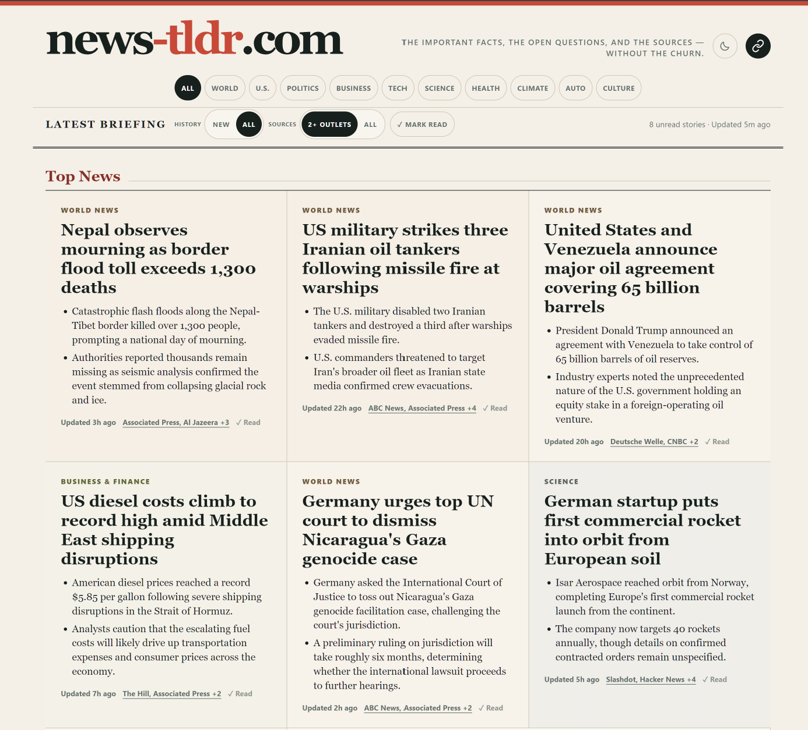
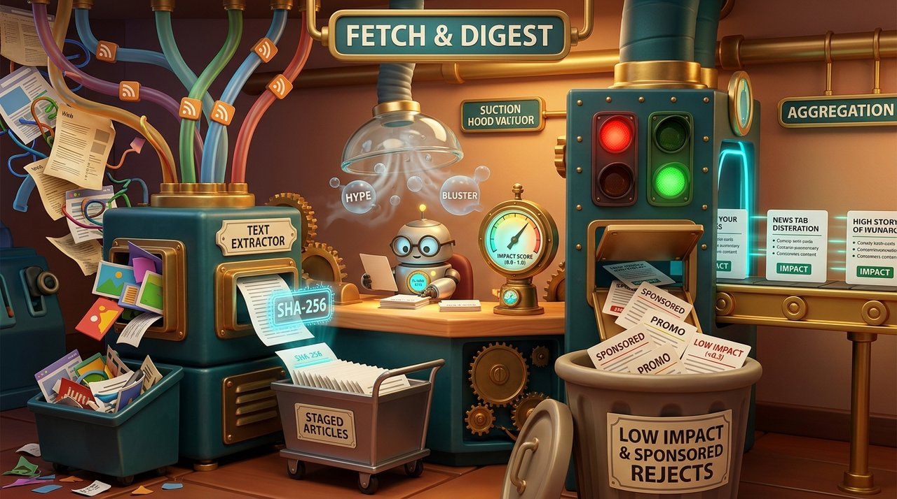
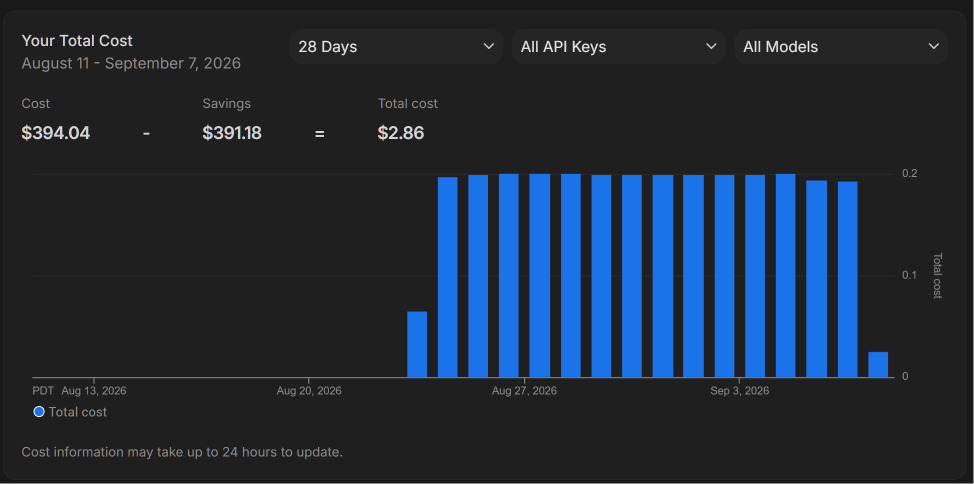

I'm a news junkie (well, really an information junkie). Usually I consume it through a combination of listening to WTOP news radio when commuting and a Feedly curated feed that I scan from time to time (usually once a day in the evenings). RIP [Google Reader](https://en.wikipedia.org/wiki/Google_Reader)!

The main problems I have with my current methods are that there is a lot of cruft and it is more time consuming than it should be:
- The Feedly aggregated RSS feeds have a LOT of duplicated content from multiple sources.
- There is a mix of "sponsored" posts, paid placements and actual stories in news sources these days.
- There are a LOT of ads on the radio broadcast (I'd say 50/50 content vs ads).
- There is a LOT of bias (in both directions) in the reporting, depending on the source.
- There is a lot of low-information clickbait making scanning hard.

Most of that seemed solvable by AI these days so I went ahead and built it. [news-tldr.com](https://news-tldr.com/) is my take on a modern editorial news feed that is focused on "just the facts" and made for easy skimming with minimal duplication and some level of ordering from "top news" to less-impactful articles.

The site itself is using the feeds I curated (intentionally using sources domestic and international with left and right-wing bias included). It's mostly intended for personal consumption but feel free to use it if you find it useful. It publishes hourly and has a rolling set of articles from the last 72 hours (though it is set up to default to only showing new content you haven't seen yet).

The code is all on [GitHub](https://github.com/pmeenan/news-tldr.com) with an Apache 2.0 license so feel free to fork it or use any part of it for your own purposes as well.

## How it works

The workflow is basically a pipeline that takes all of the articles it can get its hands on as input and spits out a curated "here's what you need to know" set of articles. It largely mirrors what I'd have to do in my head manually off of the raw feeds before.

### Article ingestion

The first step of the pipeline is to get the raw data and extract the key information from each article:

- Fetches all of the new articles from the configured RSS feeds.
- Uses Gemini 3.5 flash-lite to extract the contents and key points from each article.
- Ranks the "impact" of each article, flagging sponsored or paid content (in the same flash-lite extraction pass).

From this we end up with a clean set of summarized articles with keywords and facts extracted (and original text and source link maintained).

### Article grouping

From there, the summarized articles are grouped and de-duplicated against each other so individual multi-sourced "events" can be reported as a single story:

- Articles are grouped based on extracted keywords.
- Gemini 3.5 flash-lite is given batches of articles to group, both new and existing articles as well as a list of existing groups.
- Questionable "borderline" cases are handed to Gemini 3.7 flash for decision.

At this point we now have a bunch of "stories", a lot of which are multi-sourced with several supporting articles.

### Editorial

The final stage in the pipeline is to take the hundreds of individual stories and curate an editorial page with related stories grouped together and more-important stories being displayed first.

To keep the models from hallucinating and avoid blowing up token costs by feeding full article text to the larger models, a fast Flash-Lite pass first extracts an "evidence ledger" of key claims backed by exact verbatim quotes from the articles (which code verifies actually exist in the source text). Gemini 3.7 flash then drafts the neutral headline and two-bullet briefing strictly from that ledger, followed by an independent verification pass that cross-checks every claim against the quotes before stamping it approved. It also handles the final homepage curation to pick the top news and group related topics.

## Architecture and tech stack

Just to be clear, in case there was any doubt, AI wrote all of the actual code (and generated the images for this article). I steered the architecture, drove the work and reviewed the results but I don't think I wrote a single line of the actual code. Models from pretty much all of the frontier labs were involved over the last few weeks in building it:

- Google (in Antigravity): Gemini 3.1 Pro, 3.7 Flash and 3.8 Flash (all on High)
- OpenAI (in Codex): Sol 5.6 (high and extra high), Astra (medium and high)
- Anthropic (in Claude Code): Opus 5 (high), Fable 5 (high), Fable 5.1 (medium and high)

They served both in building the pipeline/writing the code as well as judging the Gemini model's success at each stage of the pipeline, refining the API calls and prompts to make sure the data extraction, grouping and editorial passes were good.

### Gemini API and models

One of the less-appreciated features of the [Google AI Ultra](https://one.google.com/intl/en_us/about/google-ai-plans/) subscriptions is that you get a $100 monthly Google cloud credit that can be used for, among other things, the Gemini API. That's why pretty much everything in the pipeline uses some flavor of Gemini. I'm still not exactly sure what byzantine labyrinth I went through actually worked, but I think it was activating an API key through [AI Studio](https://aistudio.google.com/) that is linked to my "personal" billing account (which I may have had to accept the developer program to link - I can't remember).

Since this is a batch pipeline, I am also using the "flex" priority when calling the API which cuts the costs in half and still provides responses in a few seconds. This is why it is using 3.7 flash instead of 3.8 though, because 3.8 was erroring with the flex tier (probably capacity constraint).

As far as I can tell, the actual costs are coming in way under the promotional credit, but that's not saying much because I really have no idea from the current billing dashboard. Worst-case it is costing me $0.20 per day but I really have no idea what to make of the actual reports (why are all cloud products so bad?).

I'd sure be a lot more comfortable if I knew what "savings" were from and where my cloud credits factor into this.

If I was actually doing this for real, I'd be REALLY inclined to buy a DGX spark or two and run models that I control (though you probably don't want Chinese models doing the editorial on news content).

### Tech stack

The actual tech stack itself is as boring as it gets:

- Cron scheduling.
- Python for running the actual pipeline (fetch, AI API calls, producing the static HTML and JSON).
- Raw articles stored in flat-files on disk.
- SQLite datastore for the extracted and processed article details and editorial decisions.
- Static HTML single-page app, served with 10-minute cache through Cloudflare.
- Vanilla JavaScript for in-page interactions, read article tracking, etc.

### Cross-browser linking

I use browsers on a lot of devices and REALLY wanted to be able to synchronize the read articles across them so I could pick up any device and just see unread news.

The easy answer would be to allow for login and track the read state per-user but that's more complicated than I really wanted (and there's no reason for the site to have the actual email address of the visitor). I've set up OAuth login before using the well-known providers and it's a pain to get the site registered and working and to do the back-end validation.

What I REALLY wanted was some form of profile-based storage that the site could request, user could approve and it would sync with your browser account across devices (like history, extensions, etc). That could have provided a zero-infrastructure mechanism for sharing without the server having to have any knowledge. Sadly, no such thing exists (outside of extensions).

What I ended up building was a simple token/URL-based linking system where any browser can request an unguessable "token" from the server which gives them a URL that can be opened on any device and that browser starts syncing the read list through the server using the shared token. I then just email the URL to myself and open it on any device that I want to use the shared state (where it is stored in localStorage).

There's an icon on the top-right of the page that shows the current state and allows for creating tokens or unlinking from an existing group.

## What's next

The time I spend commuting is still pretty much wasted listening to local news radio and all of the ads. It would be fairly easy to have Gemini generate a podcast script and use one of the TTS models to create a convincing podcast of the most recent 12 hours of news (drive in and drive home). I already sketched out what that would add and it plugs in to the end of the pipeline really cleanly but I'm not sure about the costs which is the main thing holding me back.

I'd probably set it up to produce hourly so time zones won't matter (you get the last 12 hours whenever you listen) and it would be structured so it is front-loaded with the key information in the first 5 minutes and gradually gets into more depth and stories as it goes on so that it could support short and long commutes.

I set up a JSON endpoint at `/api/brief.json` that is published hourly when the page is updated that has all of the stories and editorial details for a rolling 12-hour window. I may play with some tooling manually to see how well it works in something like NotebookLM or AI Studio.

What I'd really love to see is for someone to actually start going in this direction for a REAL news feed from a real provider rather than something I cobbled together for personal use.